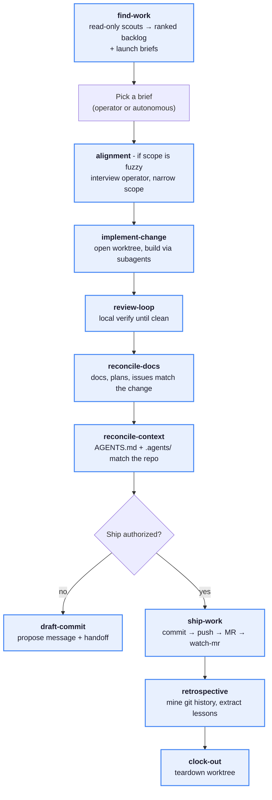

# Development loop

Find → rank → one Launch brief → fork by work type → ship path → commit per
authorization. Chat is not the backlog: issues = desired state; plans = how;
merged MRs = behavior; reconcile closes the lap.

Durable contract for the loop. Wave trackers and open decisions live under
`.scratch/` (throwaway); this file wins for how agents run a lap.

## Non-negotiables (loop)

Overrides any conflicting pattern. Full lab constraints:
[`constraints.md`](./constraints.md).

| Constraint                  | Implication                                                                                                                                                                                                                                                                                                                                                                                                                     |
| --------------------------- | ------------------------------------------------------------------------------------------------------------------------------------------------------------------------------------------------------------------------------------------------------------------------------------------------------------------------------------------------------------------------------------------------------------------------------- |
| Commit / push authorization | Default: no commit/push. Soft ship language or explicit `commit`/`push` authorizes for that lap ([`constraints.md`](./constraints.md#commit-and-ship)). Attended → may ship to `main`; autonomous → never direct `main`, feature branch + MR instead. Diverged-main stash/rebase/push recipe: [`draft-commit`](../skills/draft-commit/SKILL.md). Not authorized → ship stops at draft-commit (propose message + draft MR only). |
| Ask before cluster mutate   | No auto `kubectl apply`, `flux reconcile`, or mutating MCP without explicit ask. Unattended = read-only scouts.                                                                                                                                                                                                                                                                                                                 |
| Protected paths             | `.agents/**`, `.cursor/**`, `.claude/**`, `AGENTS.md`/`CLAUDE.md`, `talos/**`, `helm/generic-app/**`, `flux/manifests/01-bootstrap/**` → **stop / skip** unattended unless operator confirmed.                                                                                                                                                                                                                                  |
| Advice ≠ implement          | Consultative language → options only until asked to build.                                                                                                                                                                                                                                                                                                                                                                      |
| Discover is read-only       | `find-work` does not edit. Build only after a Launch brief is selected.                                                                                                                                                                                                                                                                                                                                                         |
| Empty queue                 | Lap-report and **stop**. No busywork, no tight-loop find-work.                                                                                                                                                                                                                                                                                                                                                                  |
| Stop-loss                   | 3 identical failures → stop and surface.                                                                                                                                                                                                                                                                                                                                                                                        |
| Ship model                  | Hybrid: unauthorized → [`draft-commit`](../skills/draft-commit/SKILL.md); authorized contribute → [`ship-work`](../skills/ship-work/SKILL.md) (commit → push → MR → [`watch-mr`](../skills/watch-mr/SKILL.md)). Full graph: [`self-improve`](../skills/self-improve/SKILL.md). Scout/AFK: [`run-loop`](../skills/run-loop/SKILL.md). Teardown: [`clock-out`](../skills/clock-out/SKILL.md). See [Ship model](#ship-model).      |

## Ship model

Hybrid with prime-context's work graph. Authorization still gates commits
([`constraints.md#commit-and-ship`](./constraints.md#commit-and-ship)).



| Skill                                             | Role                                                                                                                                          |
| ------------------------------------------------- | --------------------------------------------------------------------------------------------------------------------------------------------- |
| [`ship-work`](../skills/ship-work/SKILL.md)       | Authorized contribute: commit → push → open MR → hard-gate [`watch-mr`](../skills/watch-mr/SKILL.md) until merged / dismissed / blocked       |
| [`draft-commit`](../skills/draft-commit/SKILL.md) | Default when **not** authorized — propose Conventional Commit + optional draft MR body; may still ship when authorized (attended → `main` OK) |
| [`self-improve`](../skills/self-improve/SKILL.md) | Full discover → execute → reconcile → ship → retro → clock-out orchestrator                                                                   |
| [`run-loop`](../skills/run-loop/SKILL.md)         | Scout / cron / AFK brief walker (complementary; not the full contribute graph)                                                                |
| [`watch-mr`](../skills/watch-mr/SKILL.md)         | GitLab MR babysit (threads, CI, conflicts); never merge                                                                                       |
| [`clock-out`](../skills/clock-out/SKILL.md)       | Session teardown after merge                                                                                                                  |
| Agent worktrees                                   | **Required** for file edits — `.worktrees/<type>/<slug>` per [`worktrees.md`](../rules/worktrees.md). Isolation ≠ ship authority.             |

**Autonomous / self-improve:** never direct `main` — feature branch + MR; human
merges. **Attended** soft-ship may still push `main` via `draft-commit` when
explicitly that mode.

## State machine

```
find-work (read-only)
  → ranked Launch briefs (1..N)
  → walk 1→N; first eligible wins
  → fork by work type (vertical slices — not implement-only):
       alignment (HITL / fuzzy)     → stop if unattended
       plan authoring               → project-planner
       implement-change             → implementer → verifier → review
       watch-mr                     → maintain open MR
       reconcile-context            → steward / skill
       file-issue                   → docs backlog (default for broad scout findings)
       autoresearch                 → idle-only tier 8 (docs-only)
  → (shipping path)
       review-loop → reconcile-docs → reconcile-context
       → draft-commit (not authorized) | ship-work (authorized: MR + watch-mr)
       → retrospective → clock-out (after merge)
  → optional local apply to observe
  → Flux reconciles pushed truth
  → lap-report → find-work / self-improve again (or stop if empty)
```

**Observation vs durable state:** a local apply is short-lived when it differs
from Git — Flux will reassert the repository on the next reconcile. Durable
desired state is commit + push (then Flux). Do not rely on child suspends or
re-applies to keep uncommitted cluster state; see
[`traps.md`](./traps.md#gitops--flux).

Issue → plan → code (anti-rot: delete satisfied issues/plans; no `closed/`):

```
gap → (alignment if fuzzy) → file-issue (docs/issues/)
  → plan authoring
  → implement-change (one MR / lap)
  → reconcile-docs → reconcile-context
  → draft-commit (not authorized) | ship-work (authorized MR path)
  → clock-out after merge
```

Research (idle-only; writeups **persist** — not delete-on-ship):

```
approved seed / Launch brief with full contract
  → autoresearch (bounded experiments)
  → docs/research/<slug>.md + experiments/<slug>/
  → review-loop → draft-commit | ship-work (per authorization)
  → recommendations → future file-issue (separate lap)
```

## Work types / fork targets

### Available now

| Fork                       | Invoke                                                                                                         |
| -------------------------- | -------------------------------------------------------------------------------------------------------------- |
| Fuzzy scope / HITL         | [`alignment`](../skills/alignment/SKILL.md)                                                                    |
| File / update / close gaps | [`file-issue`](../skills/file-issue/SKILL.md)                                                                  |
| Context / link drift       | [`reconcile-context`](../skills/reconcile-context/SKILL.md) + `context-steward`                                |
| Plan authoring             | `project-planner` → [`docs/plans/`](../../docs/plans/README.md) (SoT); `.cursor/plans/` OK for IDE drafts      |
| Rank / pick next work      | [`find-work`](../skills/find-work/SKILL.md) (read-only)                                                        |
| Constant / unattended loop | [`run-loop`](../skills/run-loop/SKILL.md) — scout/AFK brief walker; stop gates ironclad                        |
| Full contribute graph      | [`self-improve`](../skills/self-improve/SKILL.md) — find → execute → reconcile → ship-work → retro → clock-out |
| One Launch-brief lap       | [`implement-change`](../skills/implement-change/SKILL.md)                                                      |
| Babysit open MR            | [`watch-mr`](../skills/watch-mr/SKILL.md) — threads / CI / conflicts; never merge                              |
| Idle research (tier 8)     | [`autoresearch`](../skills/autoresearch/SKILL.md) → [`docs/research/`](../../docs/research/README.md)          |
| Docs / issue / plan close  | [`reconcile-docs`](../skills/reconcile-docs/SKILL.md)                                                          |
| Local verify before ship   | [`review-loop`](../skills/review-loop/SKILL.md)                                                                |
| Commit / MR handoff        | [`draft-commit`](../skills/draft-commit/SKILL.md) (default when not authorized)                                |
| Authorized ship (MR)       | [`ship-work`](../skills/ship-work/SKILL.md) — commit → push → MR → watch-mr                                    |
| Post-merge teardown        | [`clock-out`](../skills/clock-out/SKILL.md)                                                                    |
| Manifest edit / verify     | `manifest-implementer` / `manifest-verifier`                                                                   |
| Ops / security signals     | `site-reliability-engineer` / `security-analyst`                                                               |
| Doc audits                 | `documentation-reviewer`                                                                                       |
| Domain deploy / restore    | `helm-deployment`, `mcp-deployment`, restore skills                                                            |

Lap reports: `.scratch/laps/` (see that dir’s README; ephemeral; Discord
notify-only, not SoT). Hot-MR locks: `.scratch/watch-mr/locks/` (skip if another
session owns the MR). Research sandbox: `.scratch/research/<slug>/` (gitignored;
default experiment in-scope).

Research laps are self-contained: experiment locally, ship
`docs/research/<slug>.md` + experiment log via draft-commit or ship-work (per
authorization); recommendations become future issues, not GitOps changes.
Never auto-merge.

## Ranking (debt-first)

| Tier | Class                    | Examples                                                                                                     |
| ---- | ------------------------ | ------------------------------------------------------------------------------------------------------------ |
| 1    | Production / correctness | Flux NotReady, critical alerts, red CI on default branch, security CRITICAL                                  |
| 2    | Tech debt / architecture | Ready bugs/arch issues, clustered `ponytail:`, context drift, stale plans                                    |
| 3    | MR maintenance           | Maintain-eligible open MRs (threads, failing CI, conflicts)                                                  |
| 4    | Issues                   | Ready implement / plan / plan-refresh (not 1–3)                                                              |
| 5    | Features                 | Ready feature / roadmap                                                                                      |
| 6    | Scoping                  | Needs alignment; feature plan stubs                                                                          |
| 7    | Authoring tail           | New gaps / low-priority plans when 1–6 empty                                                                 |
| 8    | Autoresearch             | Only when 1–7 empty + approved seed / contract + budgets ([`docs/research/`](../../docs/research/README.md)) |

Within tier: severity (`blocker` > `high` > `medium` > `low`) → FIFO by
`found_at`. Queue, not stack.

## Launch brief

Each actionable find-work row emits a pasteable brief. Discover is read-only;
build only after the brief is selected.

```text
## Launch N — <title>
- Source: <issue path | alert | Flux object | MR>
- Evidence: <paths / queries / links>
- Acceptance: <observable done>
- Feedback loop: <verify command(s)>
- Worktree / branch: <optional>
- Dedupe: <not in flight | skip:… | unverified>
- Constraints: <protected | HITL | no cluster mutate | …>
- Invoke: <skill or persona>
```

If you cannot name a feedback loop (`kustomize build`, `helm template`, Trivy,
Flux MCP read, yamllint, …), the work is not scoped → `alignment`. Prefer thin
slices (~1000 absolute changed lines / MR). One implement lap = one MR.

## Gates

### Always

- No commit or push without authorization (soft ship language or explicit
  `commit`/`push`); see [Non-negotiables](#non-negotiables-loop) above.
- Ask before cluster mutate.
- Advice language → do not implement.
- Empty eligible queue → lap-report and stop.
- Partial scout failure → omit implement briefs; mark `dedupe unverified`.

### Unattended (constant-loop / AFK)

- Skip `slice: hitl`, protected-path edits, and `alignment`.
- Skip `status: blocked` / `in-flight` for new implement briefs.
- Tiers 1–2 outrank `watch-mr`.
- Tiers 4–5 require zero eligible `watch-mr` (finish in-flight first).
- If every brief is ineligible → stop.

### Attended

- Protected paths still need confirmation (operator request counts; summarize first).
- Fuzzy scope → run `alignment` before implement.
- Operator may waive a gate for one lap; that waiver does not carry forward.

## Related skills

| Skill / persona                                             | Role in the loop                                                               |
| ----------------------------------------------------------- | ------------------------------------------------------------------------------ |
| [`find-work`](../skills/find-work/SKILL.md)                 | Read-only scouts → ranked Launch briefs                                        |
| [`run-loop`](../skills/run-loop/SKILL.md)                   | Scout/cron/AFK brief walker                                                    |
| [`self-improve`](../skills/self-improve/SKILL.md)           | Full contribute work graph                                                     |
| [`watch-mr`](../skills/watch-mr/SKILL.md)                   | Maintain open MR (threads, CI, conflicts)                                      |
| [`autoresearch`](../skills/autoresearch/SKILL.md)           | Idle tier-8 research; docs-only ship                                           |
| [`file-issue`](../skills/file-issue/SKILL.md)               | Backlog ledger under `docs/issues/`                                            |
| [`implement-change`](../skills/implement-change/SKILL.md)   | One lap: plan → implement → verify → handoff                                   |
| [`reconcile-docs`](../skills/reconcile-docs/SKILL.md)       | Behavior docs + delete satisfied issues/plans                                  |
| [`reconcile-context`](../skills/reconcile-context/SKILL.md) | Agent context / link health after behavior moves                               |
| [`review-loop`](../skills/review-loop/SKILL.md)             | Local gates before ship                                                        |
| [`draft-commit`](../skills/draft-commit/SKILL.md)           | Propose-only handoff when not authorized; attended `main` ship when authorized |
| [`ship-work`](../skills/ship-work/SKILL.md)                 | Authorized MR contribute path                                                  |
| [`clock-out`](../skills/clock-out/SKILL.md)                 | Post-merge worktree teardown                                                   |
| [`alignment`](../skills/alignment/SKILL.md)                 | Fuzzy scope; skip unattended                                                   |

## Out of scope

Permanent — not deferred trackers.

- Auto-merge / auto-approve MRs (human merges)
- Auto-allow protected paths or cluster mutation
- Unbounded overnight research without budgets
- Discord as system of record
- Renovate dashboard as the agent prioritizer (deps ≠ work queue)
- Swarm / harness lifecycle skills foreign to this lab
