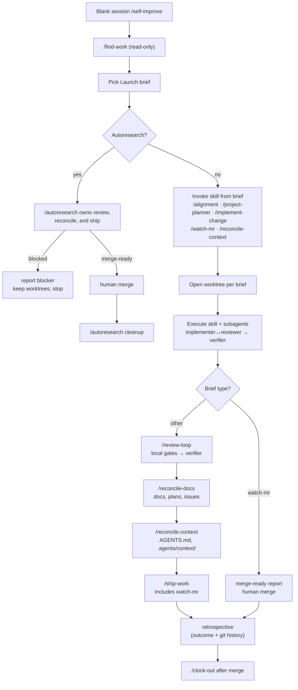

# Self-improve

**Blank start → contribution** in one orchestrated lap. Read
[`.agents/context/development-loop.md`](../../context/development-loop.md)
first (skim the diagrams; you do not need the whole `.agents/context/` folder).

**Ship model:** hybrid per
[`development-loop.md`](../../context/development-loop.md#ship-model) —
[`ship-work`](../ship-work/SKILL.md) when the lap is authorized to contribute an
MR (soft ship / `commit` / `push`, or the operator ran `/self-improve` /
`/ship-work`); otherwise stop at
[`draft-commit`](../draft-commit/SKILL.md) per
[`constraints.md`](../../context/constraints.md#commit-and-ship). Scout / cron /
AFK brief walking still uses [`run-loop`](../run-loop/SKILL.md);
`self-improve` is the full discover → ship → retro → clock-out contribute
graph.

Launch briefs from [`find-work`](../find-work/SKILL.md) are not operator-only
copy-paste. In this skill they are the **execution contract** for the same
parent: run find-work, pick a brief, invoke the skill named in **Invoke** using
the brief's copy fence as cold-start context, then finish the lap.

## Blank start path



Each lap is one path through the DAG. The graph repeats — that's the loop.

**Context-only brief:** context-only laps (find-work ranks drift):
`reconcile-context` → `review-loop` → `ship-work` (skip `reconcile-docs`
unless docs also changed).

## What one lap is

1. **Discover** — sync main, then run [`find-work`](../find-work/SKILL.md)
   (read-only scouts + ranked report + launch briefs).
2. **Pick** — operator names Launch N, or (when authorized) walk Launch briefs 1→N
   with clean dedupe and no blockers below.
3. **Execute** — read the picked brief's copy fence; invoke **Invoke** in
   **this session** with that payload (`Source`, `Evidence`, `Acceptance`, `Worktree`,
   `Dedupe`, `Constraints`). Follow the downstream skill through worktree setup
   and subagents.
4. **Review** — [`review-loop`](../review-loop/SKILL.md) before commit (skip for
   `watch-mr` maintenance laps and self-contained `autoresearch` laps).
5. **Reconcile docs** — [`reconcile-docs`](../reconcile-docs/SKILL.md) before
   ship when behavior, plans, or issues moved (skip for context-only and
   `watch-mr` laps; `autoresearch` owns its own ship path).
6. **Reconcile context** — [`reconcile-context`](../reconcile-context/SKILL.md)
   before ship on shipping laps (skip the outer step for `watch-mr` maintenance
   and `autoresearch` laps).
7. **Ship** — [`ship-work`](../ship-work/SKILL.md) when reviewers are clean
   and the lap is authorized to contribute (see ship model above; otherwise stop
   at [`draft-commit`](../draft-commit/SKILL.md)). Hard-gates
   [`watch-mr`](../watch-mr/SKILL.md) on the shipped MR until merged, dismissed,
   or hard-blocked; do not run a second standalone `watch-mr` lap after
   `ship-work` completes; skip the outer ship path for `watch-mr`-only and
   `autoresearch` laps.
8. **Retrospective** — [`retrospective`](../retrospective/SKILL.md) after
   ship-work and before clock-out. Reviews outcomes, mines git history for
   external changes to context surfaces, classifies lessons, and routes
   improvements. Not a gate — declares "no lessons" when there's nothing to
   capture. Runs while the worktree still exists (`autoresearch` laps: autoresearch
   runs retrospective as part of its own cleanup path, before deleting worktrees;
   `watch-mr` dismissal laps skip).
9. **Cleanup** — [`clock-out`](../clock-out/SKILL.md) after merge and
   retrospective (`autoresearch` waits for merge, runs retrospective, then owns
   cleanup; do not `clock-out` after a `watch-mr` dismissal).
10. **Loop** — `/find-work` or `/self-improve` again (new session recommended
    after a full lap; same session OK for another discover-only pass).

This skill orchestrates steps 1–3 and routes to downstream skills. It does not
skip worktrees or alignment when fuzzy. **`watch-mr` maintenance laps** skip
`review-loop`, both reconcile steps, and `ship-work` unless fixes change behavior
or agent context (then reconcile before merge). **`autoresearch` laps** are
self-contained: the skill owns its worktrees, review, reconcile, ship, and
retrospective; it stops without cleanup when blocked. Once merge-ready, it
waits for the human to merge, then runs retrospective before its own cleanup.
Do not run the outer ship path, outer retrospective, or outer clock-out after it
returns.

## Checklist

```
- [ ] 1. Read .agents/context/development-loop.md (one lap + state machine + ship model)
- [ ] 2. Sync main, then run find-work (read-only; report + launch briefs)
- [ ] 3. Pick Launch N (operator) or walk Launch briefs 1→N (autonomous rules below)
- [ ] 4. Invoke the brief's skill using the copy fence as cold-start context
- [ ] 5. If alignment-only brief: run alignment and stop for operator proceed
- [ ] 6. Else: `watch-mr` brief → run watch-mr only until merged, dismissed, or hard-blocked (skip review-loop, reconcile, ship-work unless the brief says otherwise; merge-ready is a milestone, not the exit; `clock-out` only after merge, not after dismissal); `autoresearch` brief → run autoresearch through its own review, reconcile, and ship; if blocked, report and stop with both worktrees intact; if merge-ready, wait for the human to merge, then autoresearch runs retrospective and owns cleanup; stop the outer path; `reconcile-context` brief → reconcile-context → review-loop → ship-work (skip reconcile-docs); other shipping briefs → review-loop → reconcile-docs (if applicable) → reconcile-context → ship-work when authorized (includes watch-mr until merged, dismissed, or hard-blocked; no second standalone watch-mr lap); unauthorized → draft-commit handoff and stop
- [ ] 7. Do not start the next `/find-work` lap while `ship-work` on the current MR is still in progress or blocked on unresolved threads you could address
- [ ] 8. After merge: run retrospective (outcome review + git history mining + classify + route; skip for watch-mr dismissal laps)
- [ ] 9. Clock-out (unless autoresearch already cleaned up)
- [ ] 10. Report lap outcome; suggest next /find-work or /self-improve
```

## Picking a brief

| Situation                                                           | Pick                                                                                                       |
| ------------------------------------------------------------------- | ---------------------------------------------------------------------------------------------------------- |
| Operator says "take Launch 2"                                       | Launch 2                                                                                                   |
| Operator says "take the top item" / autonomous lap                  | Walk Launch briefs 1 → N; take the first eligible row                                                      |
| Operator ran `/find-work` only and did not say go                   | **Stop** after briefs; wait for pick                                                                       |
| Picked row is `alignment` only                                      | Run alignment; **stop** for proceed before plan/code                                                       |
| Picked row is `watch-mr`                                            | MR maintenance lap; run watch-mr until merged/dismissed/hard-blocked; clock-out only after merge           |
| Picked row is `autoresearch`                                        | Blocked → report and keep worktrees; merge-ready → human merge → autoresearch owns retrospective + cleanup |
| Picked row is `reconcile-context`                                   | Context drift lap; ship path skips reconcile-docs                                                          |
| Picked row is `slice: hitl`                                         | **Stop**; need operator in loop                                                                            |
| Dedupe failed or `dedupe unverified` on implement/plan/research row | **Stop**; report why                                                                                       |
| Protected-path edit required                                        | **Stop**; surface change per protected-paths rule                                                          |

## Autonomous pick (when operator says go)

Allowed when the operator explicitly says to take the top item, run the loop,
`/self-improve` without naming a task, or unattended automation under the gates
in [`development-loop.md`](../../context/development-loop.md) plus this skill's
autonomous pick table below.

**Walk Launch briefs 1 → N** (not rank-1 only). Take the first brief that passes
the gates below. When Launch 1 is ineligible, fall through to Launch 2, and so
on. See [`find-work` autonomous gates](../find-work/SKILL.md#autonomous-gates).

| Brief skill         | Autonomous gate                                                                                                    |
| ------------------- | ------------------------------------------------------------------------------------------------------------------ |
| `watch-mr`          | `Dedupe` lacks `skip:hot-lock` / `skip:` **or** has `eligible:pusher-session`; not `slice: hitl`                   |
| `implement-change`  | `Dedupe: not in flight` or `eligible`; not `blocked`; not `slice: hitl`; **no eligible `watch-mr` in this report** |
| plan authoring      | No eligible watch-mr/implement in this report; dedupe clean; FIFO: oldest `found_at` when severities tie           |
| `file-issue`        | No eligible watch-mr/implement/plan in this report; dedupe clean; FIFO by gap age when known                       |
| `reconcile-context` | Drift row; no eligible watch-mr/implement/plan/issue in this report                                                |
| `autoresearch`      | Tier-10 row with complete research contract; no eligible tier 1–9 row in this report; dedupe clean                 |
| `alignment`         | **Autonomous unattended:** skip row (fall through). **Manual:** run and stop for operator proceed                  |

Requirements for any picked row:

- `find-work` **Dedupe** does not contain `skip:`
- If a `watch-mr` brief has `skip:hot-lock`, leave it ineligible and keep walking
  later briefs
- Not `slice: hitl` without operator already engaged
- Not protected-path edits without confirmation
- Prefer **`watch-mr`** over **`implement-change`** when both briefs are eligible
  (unresolved threads on open MRs outrank new features). Prefer maintain and
  implement over plan or issue authoring when those briefs are eligible (tail
  work when they are not)

If every Launch brief is ineligible, write a lap-report and **stop** (do not
re-run find-work in a tight loop). **Autonomous unattended:** skip `alignment`
rows; do not stop solely because rank-1 is alignment or needs-scoping when a
later eligible plan, `file-issue`, `reconcile-context`, or `autoresearch` brief
exists.

## Do not

- Edit files during find-work discovery (read-only)
- Treat launch briefs as chat-only output when running `/self-improve`
- Do **not** choose plan or issue authoring in autonomous laps while any
  `watch-mr` or `implement-change` brief is eligible in the same report
  (operator manual may still pick any severity)
- Do **not** run a standalone `/watch-mr` lap after `ship-work` on the same MR
  (`ship-work` already hard-gates watch-mr until merged, dismissed, or hard-blocked)
- Do **not** implement a plan that [`find-work`](../find-work/SKILL.md) ranks
  behind eligible maintain/implement work, or that is `status: blocked` /
  missing prerequisites in [`docs/plans/`](../../../docs/plans/README.md).
  Prefer debt-first tiers over unchecked checkbox count.
- Skip `reconcile-docs` before ship when behavior or issues/plans moved (except
  `watch-mr` maintenance laps, which skip the whole ship path)
- Skip `reconcile-context` before ship on shipping laps (context-only laps use
  it as the build step; `watch-mr` laps skip it)
- Pack a whole plan phase into one MR
- Commit without `review-loop` (except `watch-mr` maintenance laps, which push
  without a new commit from this skill, and `autoresearch`, which runs review
  inside its own ship path)
- Use branch names like `plan-03-phase-a-shipped` or platform defaults
  (`featurehomelab-self-improve-lap-*`); use `type/short-slug` only — see
  [`worktrees.md`](../../rules/worktrees.md)
