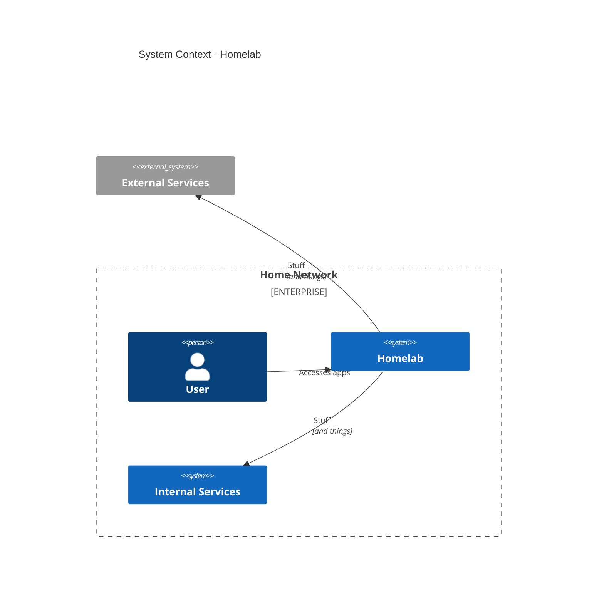
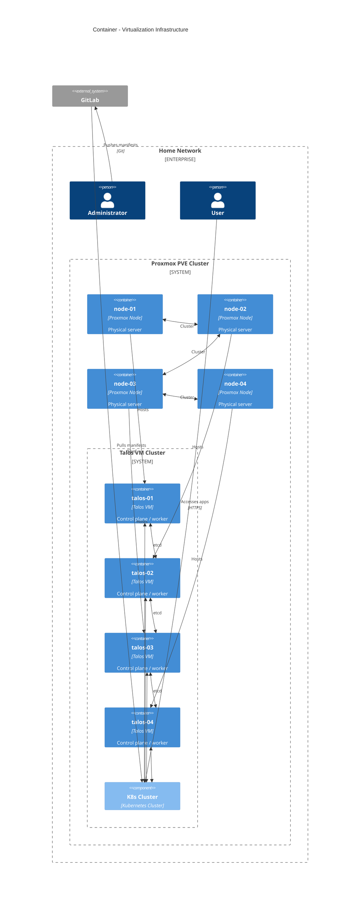
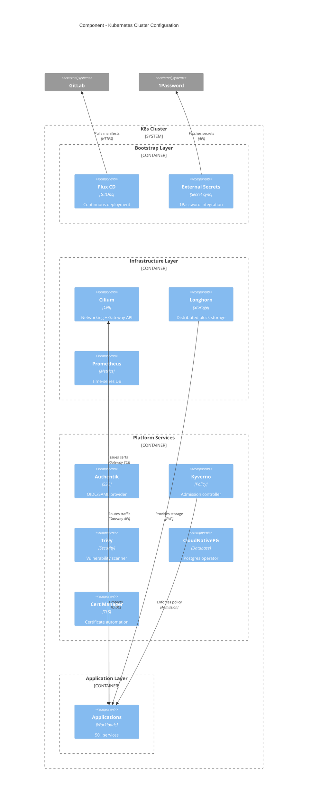

# Homelab Kubernetes Cluster

 

This repository contains the configuration for my home Kubernetes cluster managed through GitOps.

> **Navigation**: [Next: Cluster Bootstrap →](./talos/README.md)

## Overview

A production-like Kubernetes cluster built on Talos Linux, managed entirely through Flux GitOps. The cluster provides a robust platform for hosting home services while providing a platform for learning Kubernetes concepts through hands-on experimentation.

## Why This Repository?

My background is in security (see my [resume](https://gitlab.com/apocrathia/resume)), and I run my homelab with the same rigor I apply professionally: infrastructure as code, GitOps workflows, comprehensive monitoring, and defense-in-depth security practices.

This repository is public because I believe in **transparent engineering**. By exposing my infrastructure decisions to scrutiny, I demonstrate practical security architecture, invite feedback from the community, and maintain accountability to best practices. If you're evaluating my work, you're seeing real-world implementation of enterprise security patterns at scale, and I actively encourage you to call out anything you think could be improved.

Yes, there are risks to publishing infrastructure configurations. Much of that has been mitigated through proper secrets management and continuous security scanning. However, the benefits of collaboration, learning, and demonstrating competency far outweigh the theoretical attack surface. It's just a homelab.

## Architecture

#### Level 1: System Context

#### Level 2: Container

#### Level 3: Component

#### Level 4: Code (GitOps Structure)

Go look at the [flux/manifests](./flux/manifests) directory for the GitOps structure.

### Core Infrastructure

- **Kubernetes Distribution**: Talos Linux (vanilla k8s)
- **GitOps**: Flux CD for continuous deployment
- **Secrets Management**: 1Password Connect
- **Storage**: Longhorn distributed storage with SMB integration
- **Networking**: Cilium CNI with Gateway API
- **Authentication**: Authentik SSO with automated outpost deployment

### Cluster Topology

- **Control Plane**: 4 nodes for high availability (Quorum + 1 Failure)
- **Worker Nodes**: Same 4 nodes as control plane
- **Virtualization**: Proxmox PVE
- **Storage**: Longhorn distributed block storage
- **Networking**: Cilium with Gateway API

## Key Technologies

- **GitOps**: Flux CD for continuous deployment
- **Secrets Management**: 1Password Connect
- **CI/CD**: GitLab Agent + Runner
- **Storage**: Longhorn + SMB integration
- **Networking**: Cilium CNI with Gateway API
- **Authentication**: Authentik SSO
- **Monitoring**: Prometheus + Grafana LGTM (Loki, Grafana, Tempo, Mimir)
- **Security**: Kyverno policies + Trivy scanning
- **Database**: CloudNativePG operator
- **Automation**: Renovate + n8n + kyverno

## Application Deployment

Applications are deployed using the `generic-app` Helm chart with built-in patterns for:

- **Authentik SSO Integration**: Automatic outpost deployment
- **Gateway API Routing**: External access management
- **Storage Integration**: Longhorn or SMB network storage
- **Secrets Management**: 1Password Connect integration
- **Security**: RBAC, network policies, and security contexts

## Documentation Navigation

### 🏗️ Getting Started

- **[Cluster Bootstrap](./talos/README.md)** - Complete Talos Linux cluster setup
- **[1Password Connect Setup](./flux/manifests/01-bootstrap/1password/README.md)** - 1Password Connect setup
- **[Flux Setup](./flux/README.md)** - GitOps deployment configuration
- **[Generic App Chart](./helm/generic-app/README.md)** - Reusable Helm chart

### 🏢 Layer Navigation

- **[Bootstrap Layer](./flux/manifests/01-bootstrap/README.md)** - Core components
- **[Infrastructure Layer](./flux/manifests/02-infrastructure/README.md)** - Networking, storage, monitoring
- **[Services Layer](./flux/manifests/03-services/README.md)** - Platform services and security
- **[Apps Layer](./flux/manifests/04-apps/README.md)** - User-facing applications

## Security

- **Policy Enforcement**: Kyverno policies for namespace isolation and resource cleanup
- **Vulnerability Scanning**: Trivy operator with continuous security scanning
- **Secret Management**: 1Password Connect with External Secrets Operator
- **Network Security**: Cilium network policies and Gateway API with TLS termination
- **Pod Security**: Talos Linux with minimal attack surface and security contexts

## External Resources

- [Talos Linux Documentation](https://talos.dev/)
- [Flux Documentation](https://fluxcd.io/)
- [Cilium Documentation](https://docs.cilium.io/)
- [Longhorn Documentation](https://longhorn.io/docs/)
- [Authentik Documentation](https://docs.goauthentik.io/)
