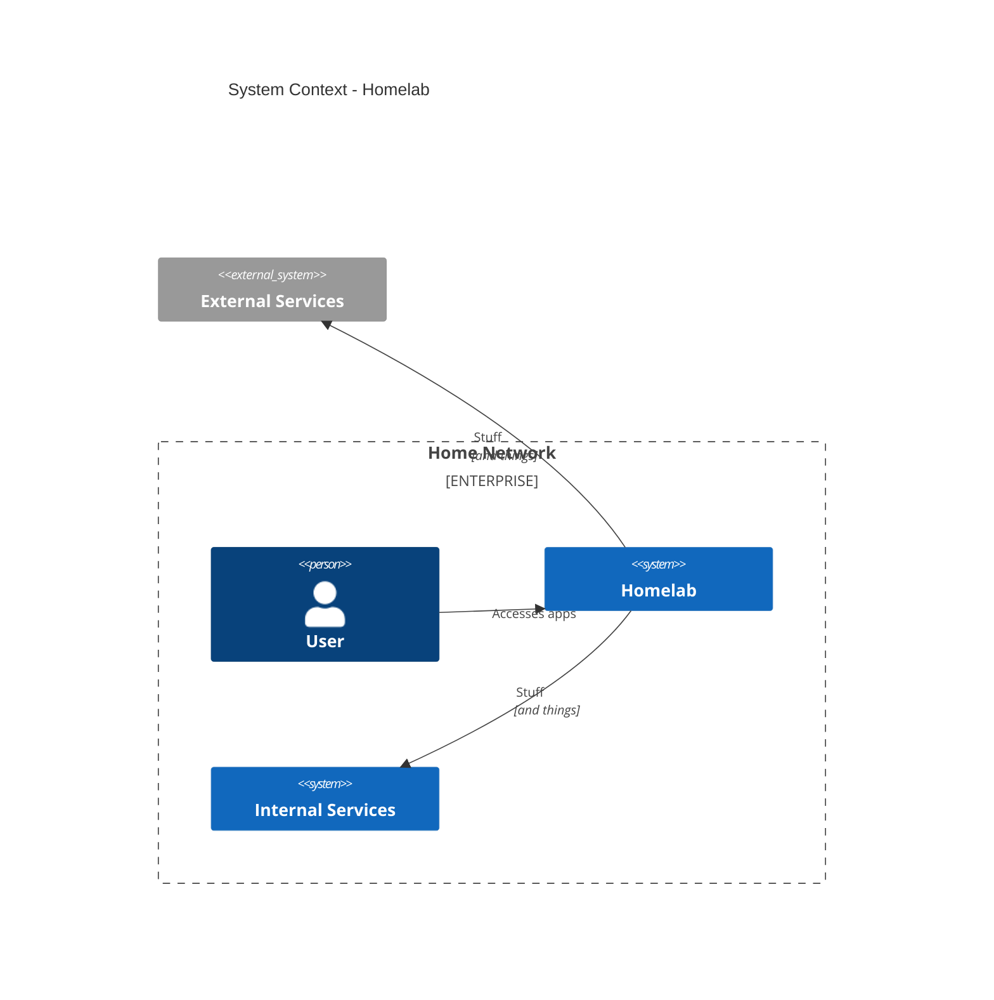
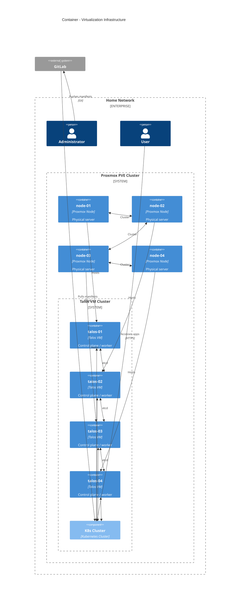
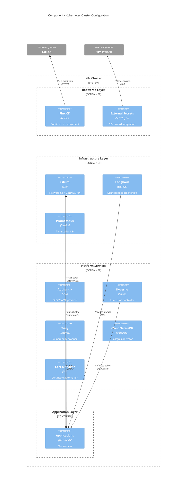

# Homelab Kubernetes cluster

 

Configuration for my home Kubernetes cluster, managed through GitOps.

> **Navigation**: [Next: Cluster bootstrap →](./talos/README.md)

## Overview

A Kubernetes cluster built on Talos Linux, managed through Flux GitOps. I use it to host home services and learn Kubernetes by breaking things in a controlled environment.

## Why this repository is public

My background is in security (see my [resume](https://gitlab.com/apocrathia/resume)). I run my homelab with the same rigor I apply professionally: infrastructure as code, GitOps workflows, monitoring, and layered security.

This repository is public because I believe in showing my work and holding myself accountable. Publishing infrastructure decisions exposes them to scrutiny, invites feedback, and keeps me honest about best practices. If you're evaluating my work, you're seeing real implementation of enterprise security patterns. I actively encourage you to call out anything that could be improved.

Yes, there are risks to publishing infrastructure configurations. I've mitigated most of them through proper secrets management and continuous security scanning. The benefits of collaboration and learning outweigh the theoretical attack surface. It's just a homelab.

## Architecture

I maintain accurate documentation so future me (or anyone else, \*cough\* AI agents \*cough\*) can understand what's going on. C4 diagrams work well for this. Mermaid's C4 support is [still maturing](https://docs.mermaidchart.com/mermaid-oss/syntax/c4.html), so don't expect these to be perfect.

#### Level 1: System context

```mermaid
C4Context
    title System Context - Homelab

    Enterprise_Boundary(homenet, "Home Network") {
        Person(user, "User")

        System(homelab, "Homelab")
        System(internal, "Internal Services")
    }

    System_Ext(external, "External Services")

    Rel_Right(user, homelab, "Accesses apps")
    Rel_Down(homelab, internal, "Stuff", "and things")
    Rel_Down(homelab, external, "Stuff", "and things")
```

#### Level 2: Container

```mermaid
C4Container
    title Container - Virtualization Infrastructure

    System_Ext(gitlab, "GitLab")

    Enterprise_Boundary(homenet, "Home Network") {
        Person(admin, "Administrator")
        Person(user, "User")

        System_Boundary(proxmox, "Proxmox PVE Cluster") {
            Container(pve1, "node-01", "Proxmox Node", "Physical server")
            Container(pve2, "node-02", "Proxmox Node", "Physical server")
            Container(pve3, "node-03", "Proxmox Node", "Physical server")
            Container(pve4, "node-04", "Proxmox Node", "Physical server")

            System_Boundary(talos, "Talos VM Cluster") {
            Container(k8s1, "talos-01", "Talos VM", "Control plane / worker")
            Container(k8s2, "talos-02", "Talos VM", "Control plane / worker")
            Container(k8s3, "talos-03", "Talos VM", "Control plane / worker")
            Container(k8s4, "talos-04", "Talos VM", "Control plane / worker")

            Component(K8sCluster, "K8s Cluster", "Kubernetes Cluster")
            }
        }
    }

    Rel_Down(pve1, k8s1, "Hosts")
    Rel_Down(pve2, k8s2, "Hosts")
    Rel_Down(pve3, k8s3, "Hosts")
    Rel_Down(pve4, k8s4, "Hosts")

    BiRel(pve1, pve2, "Cluster")
    BiRel(pve2, pve3, "Cluster")
    BiRel(pve3, pve4, "Cluster")

    BiRel(k8s1, k8s2, "etcd")
    BiRel(k8s2, k8s3, "etcd")
    BiRel(k8s3, k8s4, "etcd")

    BiRel(k8s1, K8sCluster, "")
    BiRel(k8s2, K8sCluster, "")
    BiRel(k8s3, K8sCluster, "")
    BiRel(k8s4, K8sCluster, "")

    Rel_Up(admin, gitlab, "Pushes manifests", "Git")
    Rel_Down(gitlab, K8sCluster, "Pulls manifests", "Flux")
    Rel_Down(user, K8sCluster, "Accesses apps", "HTTPS")

    UpdateLayoutConfig($c4ShapeInRow="4", $c4BoundaryInRow="1")

    UpdateRelStyle(pve1, pve2, $offsetY="10")
    UpdateRelStyle(pve2, pve3, $offsetY="-10")
    UpdateRelStyle(k8s1, k8s2, $offsetY="10")
    UpdateRelStyle(k8s2, k8s3, $offsetY="-10")
```

#### Level 3: Component

```mermaid
C4Component
    title Component - Kubernetes Cluster Configuration

    System_Ext(gitlab, "GitLab")
    System_Ext(onepassword, "1Password")

    System_Boundary(K8sCluster, "K8s Cluster") {
        Container_Boundary(bootstrap, "Bootstrap Layer") {
            Component(flux, "Flux CD", "GitOps", "Continuous deployment")
            Component(eso, "External Secrets", "Secret sync", "1Password integration")
        }

        Container_Boundary(infra, "Infrastructure Layer") {
            Component(cilium, "Cilium", "CNI", "Networking + Gateway API")
            Component(longhorn, "Longhorn", "Storage", "Distributed block storage")
            Component(prometheus, "Prometheus", "Metrics", "Time-series DB")
        }

        Container_Boundary(platform, "Platform Services") {
            Component(authentik, "Authentik", "SSO", "OIDC/SAML provider")
            Component(kyverno, "Kyverno", "Policy", "Admission controller")
            Component(trivy, "Trivy", "Security", "Vulnerability scanner")
            Component(cnpg, "CloudNativePG", "Database", "Postgres operator")
            Component(certmgr, "Cert Manager", "TLS", "Certificate automation")
        }

        Container_Boundary(apps, "Application Layer") {
            Component(userApps, "Applications", "Workloads", "50+ services")
        }
    }

    Rel_Up(flux, gitlab, "Pulls manifests", "HTTPS")
    Rel_Up(eso, onepassword, "Fetches secrets", "API")
    Rel_Up(certmgr, cilium, "Issues certs", "Gateway TLS")
    Rel_Down(cilium, userApps, "Routes traffic", "Gateway API")
    Rel_Down(longhorn, userApps, "Provides storage", "PVC")
    Rel_Down(authentik, userApps, "Protects", "OIDC")
    Rel_Down(kyverno, userApps, "Enforces policy", "Admission")

    UpdateLayoutConfig($c4ShapeInRow="4", $c4BoundaryInRow="1")
```

#### Level 4: Code (GitOps structure)

See [flux/manifests](./flux/manifests) for the GitOps structure.

### Cluster topology

Four Proxmox nodes. Each hosts a Talos VM. All four VMs run as both control plane and worker nodes (quorum + 1 failure tolerance). Storage is Longhorn distributed block storage. Networking is Cilium with Gateway API.

### Stack

| Category   | Technology                                    |
| ---------- | --------------------------------------------- |
| OS         | Talos Linux                                   |
| GitOps     | Flux CD                                       |
| Secrets    | 1Password Connect + External Secrets Operator |
| CI/CD      | GitLab Agent + Runner                         |
| Storage    | Longhorn + SMB                                |
| Networking | Cilium CNI + Gateway API                      |
| Auth       | Authentik SSO                                 |
| Monitoring | Prometheus, Grafana, Loki, Tempo, Mimir       |
| Security   | Kyverno policies, Trivy scanning              |
| Database   | CloudNativePG                                 |
| Automation | Renovate, n8n, Kyverno                        |

## Application deployment

Applications deploy via the `generic-app` Helm chart, which handles Authentik SSO integration, Gateway API routing, Longhorn/SMB storage, 1Password secrets, and security contexts.

## Documentation

### Getting started

- [Cluster bootstrap](./talos/README.md) - Talos Linux cluster setup
- [1Password Connect setup](./flux/manifests/01-bootstrap/1password/README.md)
- [Flux setup](./flux/README.md) - GitOps deployment
- [Generic app chart](./helm/generic-app/README.md) - Reusable Helm chart

### Layer navigation

- [Bootstrap layer](./flux/manifests/01-bootstrap/README.md) - Core components
- [Infrastructure layer](./flux/manifests/02-infrastructure/README.md) - Networking, storage, monitoring
- [Services layer](./flux/manifests/03-services/README.md) - Platform services and security
- [Apps layer](./flux/manifests/04-apps/README.md) - User-facing applications

## Security

Kyverno policies enforce namespace isolation and resource cleanup. Trivy scans continuously for vulnerabilities. Secrets come from 1Password via External Secrets Operator. Cilium handles network policies and Gateway API terminates TLS. Talos Linux provides a minimal attack surface.

## External resources

- [Talos Linux](https://talos.dev/)
- [Flux](https://fluxcd.io/)
- [Cilium](https://docs.cilium.io/)
- [Longhorn](https://longhorn.io/docs/)
- [Authentik](https://docs.goauthentik.io/)
