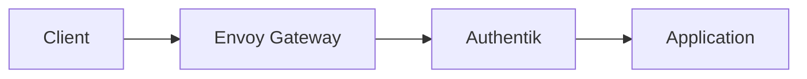
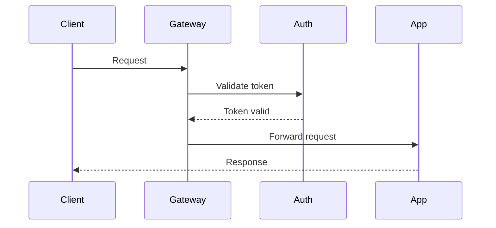

# Documentation Standards

This document defines the standards and guidelines for maintaining consistent, high-quality documentation across the homelab repository.

## Content Guidelines

### What to Include

- **Application Purpose**: Brief description of what the application does
- **Key Features**: Main functionality and capabilities
- **Access Information**: URLs, ports, and authentication details
- **Essential Configuration**: Only critical config that users need to know
- **Troubleshooting**: Common issues and diagnostic commands
- **Security Notes**: Important security considerations

### What to Omit

- **Detailed Configuration**: Don't duplicate information available in adjacent manifests
- **Complete Code Examples**: Keep only essential patterns, reference official docs for full examples
- **Implementation Details**: Focus on usage, not internal architecture
- **Version-Specific Information**: Avoid hardcoded versions unless critical

### Configuration Documentation

- **Reference Patterns**: Document configuration patterns, not actual values
- **Point to Manifests**: Use phrases like "see `helmrelease.yaml` for complete configuration"
- **Essential Only**: Include only config that users must understand to use the application
- **1Password Integration**: Always document required secret fields and their purpose

## Formatting Standards

### Structure

1. **Title**: Application name as H1
2. **Description**: 1-2 sentence overview
3. **Navigation**: Breadcrumb navigation (if applicable)
4. **Documentation**: External links section
5. **Overview**: What's deployed and key features
6. **Configuration**: Essential config details
7. **Authentication**: How auth works (if applicable)
8. **Security Considerations**: Security notes (if applicable)
9. **Troubleshooting**: Common issues and commands

### Style Guidelines

#### Links

- **External Links**: Use standard markdown format `[Link Text](https://example.com)`
- **Internal Links**: Use relative paths `[text](../path)`
- **Documentation Links**: Always include official documentation link

#### Navigation

- **Format**: `> **Navigation**: [← Back to X](../path)`
- **Placement**: After title, before description
- **Consistency**: Use same format across all READMEs

#### Code Blocks

- **Language Tags**: Always specify language for syntax highlighting
- **Fenced Blocks**: Use triple backticks with language
- **Inline Code**: Use single backticks for commands, file names, keys

#### Emphasis

- **Bold**: UI elements, important terms, section headers in lists
- **Italics**: Notes, optional information, emphasis
- **Code**: Commands, file names, configuration keys, URLs

#### Bullet Points

- **Style**: Use `-` for consistency
- **Indentation**: Use 2 spaces for sub-bullets
- **Format**: Start with capital letter, end without period (unless sentence)

### Heading Hierarchy

- **H1**: Application title only
- **H2**: Main sections (Overview, Configuration, etc.)
- **H3**: Subsections within main sections
- **H4**: Avoid unless absolutely necessary

### Mermaid Diagrams

Use Mermaid diagrams to visualize complex relationships that are difficult to convey in prose.

#### When to Use

- **Architecture/Deployment**: How services connect, network topology, infrastructure layout
- **Code/Runtime Behavior**: How requests flow, authentication sequences, API interactions
- **Decision Trees**: Troubleshooting flows or conditional logic

#### When to Avoid

- **Simple Relationships**: If a bullet list suffices, skip the diagram
- **Redundant Information**: Don't diagram what's obvious from the manifest structure
- **Frequently Changing Data**: Diagrams with version numbers or IPs become stale quickly

#### Diagram Type Selection

Choose the diagram type based on what you're documenting:

| Documenting...          | Use               | Why                                                 |
| ----------------------- | ----------------- | --------------------------------------------------- |
| Deployment/Architecture | `flowchart`       | Shows static relationships between components       |
| Code/Runtime Behavior   | `sequenceDiagram` | Shows temporal ordering of interactions             |
| Component States        | `stateDiagram`    | Shows lifecycle transitions and valid state changes |
| Simple Dependencies     | `graph`           | Lightweight alternative to flowchart                |

**Rule of thumb**: If time/ordering matters, use `sequenceDiagram`. If it's about structure/topology, use `flowchart`.

#### Formatting Guidelines

- **Language Tag**: Always use ` ```mermaid ` fencing
- **Direction**: Prefer `LR` (left-to-right) or `TB` (top-to-bottom) for readability
- **Labels**: Keep node labels concise; use full names in surrounding prose
- **Styling**: Avoid excessive custom styling; default themes render well
- **Size**: Keep diagrams focused; split large diagrams into multiple smaller ones

#### Examples

**Deployment (flowchart)** - static topology:



**Code flow (sequence diagram)** - temporal ordering:



## Maintenance Guidelines

### When to Update Documentation

- **New Features**: When applications gain new capabilities
- **Breaking Changes**: When configuration or access patterns change
- **Security Updates**: When security considerations change
- **Dependency Updates**: When external dependencies change significantly

### Version References

- **Avoid Hardcoding**: Don't include specific version numbers unless critical
- **Reference Sources**: Point to official documentation for version-specific information
- **Update Patterns**: Document configuration patterns, not specific values

### Breaking Changes

- **Document Impact**: Clearly explain what changed and why
- **Migration Steps**: Provide clear steps for users to adapt
- **Timeline**: Indicate when changes take effect

## Quality Checklist

Before submitting documentation updates:

- [ ] Follows template structure
- [ ] Uses consistent formatting
- [ ] Includes navigation breadcrumbs
- [ ] External links use angle bracket format
- [ ] Code blocks have language tags
- [ ] Troubleshooting section includes common commands
- [ ] Security considerations documented (if applicable)
- [ ] Configuration references patterns, not values
- [ ] Length appropriate for complexity (50-150 lines target)
- [ ] Mermaid diagrams used only where they add clarity (not redundant)

## Examples

### Good Documentation

- Concise but complete
- References external docs for details
- Includes practical troubleshooting
- Uses consistent formatting
- Uses diagrams to clarify complex multi-service flows

### Poor Documentation

- Duplicates manifest configuration
- Missing troubleshooting information
- Inconsistent formatting
- Too verbose or too brief for complexity
- Diagrams for trivial relationships or with hardcoded values
