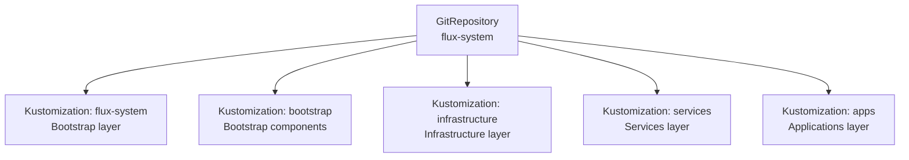

# Flux System Components

This directory contains the core Flux GitOps Toolkit components that manage the homelab cluster configuration.

> **Navigation**: [← Back to Bootstrap README](../README.md)

## Overview

The Flux System provides the foundation for GitOps-based cluster management, continuously reconciling the desired state defined in Git with the actual cluster state.

## Core Components

### GitOps Toolkit Components (`gotk-components.yaml`)

Deploys the core Flux controllers:

#### Source Controller
- **Purpose**: Manages Git repositories and Helm chart sources
- **Resources**: `GitRepository`, `HelmRepository`, `HelmChart`, `Bucket`
- **Function**: Fetches and synchronizes configuration from Git/Helm sources

#### Kustomize Controller
- **Purpose**: Applies Kubernetes manifests using Kustomize
- **Resources**: `Kustomization`
- **Function**: Reconciles Kubernetes resources from Git sources

#### Helm Controller
- **Purpose**: Manages Helm chart deployments
- **Resources**: `HelmRelease`
- **Function**: Installs and upgrades Helm charts with GitOps

#### Notification Controller
- **Purpose**: Handles notifications and alerting
- **Resources**: `Provider`, `Alert`, `Receiver`
- **Function**: Sends notifications for GitOps events and failures

### Git Repository Configuration (`gotk-sync.yaml`)

Configures the source Git repository that Flux monitors:

```yaml
apiVersion: source.toolkit.fluxcd.io/v1
kind: GitRepository
metadata:
  name: flux-system
  namespace: flux-system
spec:
  interval: 1m0s
  ref:
    branch: main
  secretRef:
    name: flux-system
  url: ssh://git@gitlab.com/apocrathia/homelab
```

### Bootstrap Manifests (`manifests.yaml`)

Root Kustomization that bootstraps all other components:

```yaml
apiVersion: kustomize.toolkit.fluxcd.io/v1
kind: Kustomization
metadata:
  name: flux-system
  namespace: flux-system
spec:
  interval: 10m0s
  path: ./flux/manifests/01-bootstrap
  prune: true
  sourceRef:
    kind: GitRepository
    name: flux-system
```

## Architecture

### Reconciliation Flow

1. **Source Controller** fetches latest changes from Git
2. **Kustomize Controller** processes Kustomization resources
3. **Helm Controller** manages Helm chart deployments
4. **Notification Controller** sends alerts on failures/successes

### Resource Hierarchy



## Configuration

### Repository Structure

The Flux system expects this Git repository structure:

```
flux/
├── manifests/
│   ├── 01-bootstrap/          # Bootstrap components
│   ├── 02-infrastructure/     # Infrastructure services
│   ├── 03-services/          # Platform services
│   └── 04-apps/              # Applications
```

### Reconciliation Intervals

- **GitRepository**: 1 minute (frequent source updates)
- **Kustomization**: 10 minutes (resource reconciliation)
- **HelmRelease**: 30 minutes (chart updates)

### Pruning and Garbage Collection

- **Prune**: `true` - Removes resources no longer in Git
- **Dependency Management**: Automatic ordering based on dependencies
- **Resource Cleanup**: Automatic removal of unused resources

## Security Configuration

### RBAC Setup

The Flux controllers run with minimal permissions:
- Service account with namespace-scoped access
- ClusterRole for necessary cluster-wide operations
- Principle of least privilege applied

### Secret Management

- **Git Access**: SSH key stored in `flux-system` secret
- **1Password Integration**: External secrets managed via 1Password Connect
- **In-Cluster Secrets**: Managed through Git with encryption where needed

## Monitoring and Observability

### Built-in Metrics

Flux exposes Prometheus metrics:
- Reconciliation duration and success rate
- Source synchronization status
- Resource inventory and drift detection
- Controller health and performance

### Integration with Monitoring Stack

- **ServiceMonitor**: Automatically created for Prometheus scraping
- **Grafana Dashboards**: Available in kube-prometheus-stack
- **Alerting**: Configurable alerts for reconciliation failures

## Troubleshooting

### Common Issues

1. **Reconciliation Failures**
   ```bash
   # Check Flux logs
   kubectl logs -n flux-system deployment/kustomize-controller
   kubectl logs -n flux-system deployment/helm-controller

   # Check resource status
   flux get kustomizations
   flux get helmreleases
   ```

2. **Git Access Issues**
   ```bash
   # Verify Git repository status
   flux get sources git

   # Check SSH connectivity
   kubectl exec -n flux-system deployment/source-controller -- ssh -T git@gitlab.com
   ```

3. **Resource Drift**
   ```bash
   # Check for drift
   flux get kustomizations --status
   flux diff kustomization flux-system
   ```

### Verification Commands

```bash
# Check overall Flux status
flux check

# View all resources managed by Flux
flux get all

# Check specific component status
kubectl get pods -n flux-system
kubectl get kustomizations -n flux-system
```

### Log Analysis

```bash
# View controller logs
kubectl logs -n flux-system -l app.kubernetes.io/name=kustomize-controller
kubectl logs -n flux-system -l app.kubernetes.io/name=helm-controller
kubectl logs -n flux-system -l app.kubernetes.io/name=source-controller
```

## Best Practices

### GitOps Workflow
1. **Branch Strategy**: Use feature branches for changes
2. **Pull Requests**: Review all changes before merging
3. **Testing**: Validate changes in development environment
4. **Rollback**: Use Git history for rollbacks

### Configuration Management
1. **Version Pinning**: Pin Helm chart versions explicitly
2. **Dependency Management**: Use `dependsOn` for proper ordering
3. **Resource Limits**: Set appropriate resource limits
4. **Namespace Isolation**: Use dedicated namespaces

### Maintenance
1. **Regular Updates**: Keep Flux components updated
2. **Security Audits**: Regular security review of configurations
3. **Backup Strategy**: Include Flux state in cluster backups
4. **Documentation**: Maintain up-to-date documentation

## Integration Points

### With 1Password
- External secret references for sensitive configuration
- Automated secret rotation and management

### With Authentik
- SSO integration for dashboard access
- RBAC integration for authorization

### With Monitoring Stack
- Metrics collection and visualization
- Alerting for GitOps failures
- Dashboard integration

## External Resources

- [Flux Documentation](https://fluxcd.io/flux/)
- [GitOps Guide](https://www.gitops.tech/)
- [Flux GitHub Repository](https://github.com/fluxcd/flux2)
- [Flux Security Guide](https://fluxcd.io/flux/security/)
