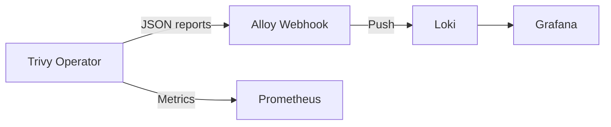

# Trivy Operator

The Trivy Operator provides continuous security scanning for Kubernetes clusters.

> **Navigation**: [← Back to Services README](../README.md)

## Documentation

- **[Trivy Operator Documentation](https://aquasecurity.github.io/trivy-operator/latest/)** - Primary documentation source
- **[GitHub Repository](https://github.com/aquasecurity/trivy-operator)** - Source code and issues

## Overview

- **Vulnerability Scans**: Automated vulnerability scanning for Kubernetes workloads
- **Configuration Audits**: Automated configuration audits with predefined rules or custom OPA policies
- **Exposed Secret Scans**: Automated secret scans to find exposed secrets
- **RBAC Scans**: Role-based access control analysis
- **Infrastructure Assessment**: Core component configuration validation
- **Compliance Reports**: CIS benchmarks, NSA/CISA guidance, and Pod Security Standards
- **SBOM Generation**: Software Bill of Materials for workloads

## Architecture



**Key design decisions:**

- **Reports → Loki**: Security reports are sent via webhook to Alloy, which forwards them to Loki. This prevents etcd bloat from CRD storage.
- **Metrics → Prometheus**: Vulnerability metrics continue to be scraped by Prometheus via ServiceMonitor.
- **Alternate storage**: Reports are written to a small scratch PVC instead of CRDs. The PVC is just ephemeral scratch space since Loki is the source of truth.

## Querying Reports in Loki

Reports can be queried in Grafana using LogQL:

```logql
{source="trivy", report_kind="VulnerabilityReport"}
```

Filter by namespace:

```logql
{source="trivy", namespace="production"}
```

## Resources

- [Trivy Operator Documentation](https://aquasecurity.github.io/trivy-operator/latest/)
- [Helm Chart Repository](https://aquasecurity.github.io/helm-charts/)
