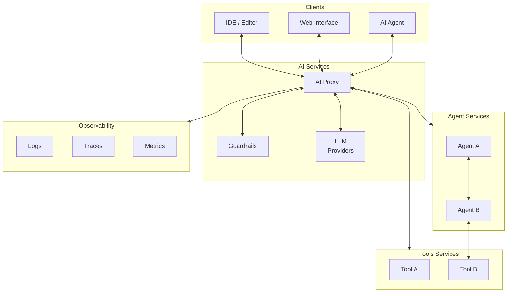

# Artificial Intelligence Applications

This directory contains AI and ML applications for the homelab.

> **Navigation**: [← Back to Apps README](../README.md)

# Architecture

## Data Flow Patterns

All AI services are exposed through a central AI proxy service with TLS termination and path-based routing.

External clients interact with the AI proxy service through the Gateway API. The AI proxy service then routes the request to the appropriate LLM provider, Agent, or Tool service. While we're using LiteLLM as our AI proxy, I want to keep this architecture flexible enough to support other AI proxy services in the future. Kong is another viable option, but lacks the discovery endpoints that LiteLLM provides and are better suited for this environment.

Direct communication between agents and tools is not favored, but has valid use-cases. There may be instances where the data flowing between them is sensitive. While everything within the boundary is of the cluster is trusted, it's still possible for data to leak if not properly secured. This is why all egress traffic from these tools and agents are proxied through the AI proxy before egress.

### High-Level Architecture

## Design Principles

- **Unified Entry Point**: Single gateway handles all external traffic
- **Path-Based Routing**: Services distinguished by URL path prefix
- **TLS Termination**: Gateway handles encryption, internal traffic can be plaintext
- **Namespace Isolation**: Each service runs in its own namespace
- **Protocol Compatibility**: LLM proxy exposes OpenAI-compatible API
- **Composable Validation**: Optional guardrails integrate transparently
- **Distributed Tracing**: OpenTelemetry traces captured via Tempo

## Applications

### [OpenWebUI](./openwebui/README.md)

User-friendly web interface for interacting with Large Language Models (LLMs) through chat interfaces.

### [Flowise](./flowise/README.md)

Open-source platform for building and deploying AI agents, providing a user-friendly web interface for interacting with Large Language Models (LLMs) through chat interfaces.

### [LiteLLM](./litellm/README.md)

Unified interface for 100+ LLMs with OpenAI proxy compatibility, providing seamless integration with various AI model providers.

### [llm-d](./llm-d/README.md)

Kubernetes-native distributed inference serving stack for large language models, providing optimized deployment patterns with vLLM and Inference Gateway.

### [Guardrails AI](./guardrails-ai/README.md)

API server providing guardrails validation for LLM outputs using community validators from the Guardrails Hub, designed for LiteLLM integration.

### [MCP Servers](./mcp-servers/README.md)

Model Context Protocol servers providing specialized functionality for AI client integration.

### [kagent](./kagent/README.md)

AI agent orchestration platform for managing and deploying AI agents in Kubernetes.

### [Agents](./agents/README.md)

Declarative AI agents orchestrated by kagent, including custom and system agents.

### [JupyterHub](./jupyterhub/README.md)

Multi-user Jupyter notebook server for interactive computing with Authentik OIDC authentication and shared SMB storage.

### [CrewAI Demo](./crewai/demo/)

Discord chatbot demo powered by CrewAI framework with web search and A2A protocol support.

### [BeeAI Demo](./beeai/demo/)

Discord chatbot demo powered by BeeAI framework with A2A protocol support.

## Overview

Artificial intelligence applications provide tools for:

- **LLM Interaction**: Web-based chat interfaces for language models
- **LLM Proxy Services**: Unified API access to multiple LLM providers
- **LLM Validation**: Guardrails for output validation and safety checks
- **LLM Observability**: OpenTelemetry tracing for all LLM requests
- **MCP Integration**: Specialized servers for AI client functionality
- **Autonomous Agents**: kagent-powered agents for various tasks
- **Vulnerability Scanning**: Security analysis through OSV database integration
- **Web Content Processing**: URL content retrieval and processing
- **Kubernetes Management**: Direct cluster access for AI-assisted operations

All applications are deployed via Flux GitOps and integrate with the homelab's authentication, monitoring, and gateway infrastructure.
