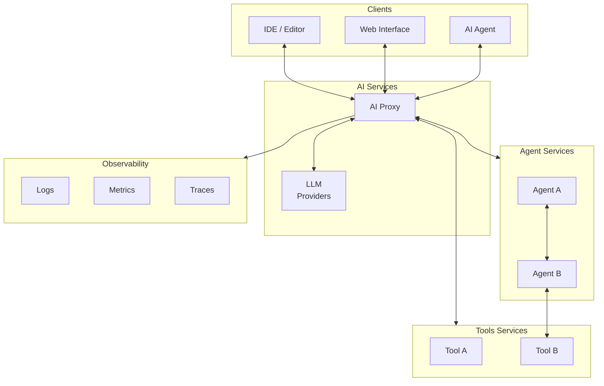

# Artificial Intelligence Applications

AI and ML applications for the homelab.

> **Navigation**: [← Back to Apps README](../README.md)

## Data Flow Patterns

External clients interact with the AI proxy through the Gateway API. The proxy routes requests to the appropriate LLM provider, agent, or tool service. LiteLLM is the proxy.

Direct communication between agents and tools is not favored but has valid use cases. When sensitive data flows between components, even within the trusted cluster boundary, leaks are possible if not properly secured. Egress traffic from agents and tools is proxied through LiteLLM for observability and control.

```mermaid
flowchart TB
    subgraph Clients["Clients"]
        direction TB
        IDE["IDE / Editor"]
        WebUI["Web Interface"]
        Agent["AI Agent"]
    end

    subgraph AIServices["AI Services"]
        direction TB
        Proxy["AI Proxy"]
        Backends["LLM<br/>Providers"]
    end

    subgraph AgentServices["Agent Services"]
        direction TB
        Agent1["Agent A"]
        Agent2["Agent B"]
    end

    subgraph ToolsServices["Tools Services"]
        direction TB
        Tool1["Tool A"]
        Tool2["Tool B"]
    end

    subgraph Observability["Observability"]
        direction TB
        Logs["Logs"]
        Metrics["Metrics"]
        Traces["Traces"]
    end

    IDE <--> Proxy
    WebUI <--> Proxy
    Agent <--> Proxy

    Proxy <--> Backends

    Proxy <--> AgentServices & ToolsServices

    Agent1 <--> Agent2
    Agent2 <--> Tool2

    Proxy --> Observability
```

## Applications

### LLM Services

- **[LiteLLM](./litellm/README.md)** - Unified proxy for 100+ LLM providers with OpenAI-compatible API
- **[llm-d](./llm-d/README.md)** - Kubernetes-native distributed LLM inference with vLLM
- **[Qdrant](./qdrant/README.md)** - Vector database for embeddings and semantic search

### User Interfaces

- **[ComfyUI](./comfyui/README.md)** - Node-graph diffusion workflow editor and API (CPU-only)
- **[OpenWebUI](./openwebui/README.md)** - Chat interface for LLMs
- **[Odysseus](./odysseus/README.md)** - Self-hosted AI workspace (chat, agents, memory, documents)
- **[OpenClaw](./openclaw/README.md)** - Personal AI assistant gateway
- **[JupyterHub](./jupyterhub/README.md)** - Multi-user notebook server with Authentik SSO

### Tasks

- **[Tasks](./tasks/README.md)** - Scheduled task templates for recurring artificial intelligence workloads

### Agent Orchestration

- **[Hermes Agent](./hermes-agent/README.md)** - Nous Research personal AI agent (gateway, dashboard, skills) backed by LiteLLM
- **[kagent](./kagent/README.md)** - Agent orchestration platform for Kubernetes
- **[Prime Agent](./prime-agent/README.md)** - Prime Intellect coding agent CLI as a persistent exec-attached agent box, backed by LiteLLM
- **[Agent Substrate](./substrate/README.md)** - gVisor sandbox runtime and WorkerPool data plane for kagent
- **[Agents](./agents/README.md)** - Declarative agents orchestrated by kagent
- **[MCP Servers](./mcp-servers/README.md)** - Model Context Protocol servers for tool integration

### Evals & Red Teaming

- **[Promptfoo](./promptfoo/README.md)** - LLM eval framework and red-teaming platform with declarative configs and a web UI
- **[PyRIT](./pyrit/README.md)** - Microsoft AI Red Team framework for probing generative AI systems via the CoPyRIT web UI

### Data & Tooling

- **[Firecrawl](./firecrawl/README.md)** - Web scraping and content extraction
- **[k8sgpt](./k8sgpt/README.md)** - Kubernetes diagnostics with LLM-backed analysis

## Design Principles

- **Unified Entry Point**: Single gateway handles all external traffic
- **Path-Based Routing**: Services distinguished by URL path prefix
- **TLS Termination**: Gateway handles encryption, internal traffic can be plaintext
- **Namespace Isolation**: Each service runs in its own namespace
- **Protocol Compatibility**: LLM proxy exposes OpenAI-compatible API
- **Distributed Tracing**: OpenTelemetry traces captured via Tempo

## References

- **[LiteLLM](https://docs.litellm.ai/)** - AI proxy and gateway
- **[kagent](https://kagent.dev/docs/)** - Agent orchestration
- **[MCP Specification](https://spec.modelcontextprotocol.io/)** - Model Context Protocol
