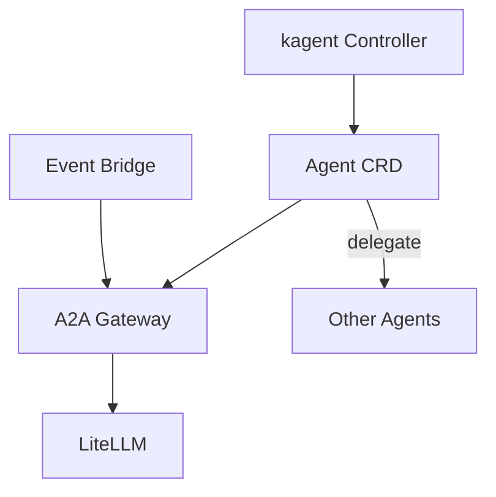

# AI Agents

Declarative AI agents orchestrated by kagent.

> **Navigation**: [← Back to AI README](../README.md)

## Overview

All agents run in the consolidated `kagent` namespace alongside the kagent controller and system agents.

**Custom Agents:**

- **[homelab](./homelab/)** - `homelab-agent`: Tech assistant for homelab topics (Discord interface)
- **[search](./search/)** - `search-agent`: Web search specialist using SearXNG
- **[knowledge](./knowledge/)** - `knowledge-agent`: Knowledge management with OpenZIM and Qdrant
- **[infrastructure](./infrastructure/)** - `infrastructure-agent`: Proxmox, TrueNAS, UniFi management
- **[media](./media/)** - `media-agent`: Plex and Servarr (Sonarr/Radarr) management
- **[git](./git/)** - `git-agent`: GitHub and GitLab operations

**System Agents (managed by kagent helm chart):**

- `k8s-agent`: Kubernetes cluster operations and troubleshooting
- `helm-agent`: Helm release management
- `cilium-policy-agent`: Cilium network policy creation
- `cilium-manager-agent`: Cilium installation and management
- `cilium-debug-agent`: Cilium debugging and diagnostics
- `observability-agent`: Prometheus/Grafana monitoring
- `promql-agent`: PromQL query generation

## Architecture

Agents are defined using kagent's declarative Agent CRD, with optional bridge components for event-driven integrations.



## Adding New Agents

1. Create a new directory under `agents/`
2. Define the Agent CRD with system prompt and model config (namespace: `kagent`)
3. Add any necessary bridge components for external integrations
4. Update this README with a link to the new agent

## Writing System Prompts

Good system prompts are critical for agent behavior. Follow the [kagent System Prompts Guide](https://kagent.dev/docs/kagent/getting-started/system-prompts) for best practices:

- **Operational Protocol** - Define step-by-step methodology for the agent
- **Tool Descriptions** - Include "Use this tool when..." with trigger phrases
- **Execution Guidelines** - Explicit behavioral rules and safety guidelines

Example structure:

```yaml
systemMessage: |
  You are a [role]. Your goal is to [purpose].

  Operational Protocol:
  1. [Step 1]
  2. [Step 2]

  Tools:
  1. tool_name
  Use when: [conditions]
  Trigger phrases: [examples]

  Execution Guidelines:
  - [Rule 1]
  - [Rule 2]
```
