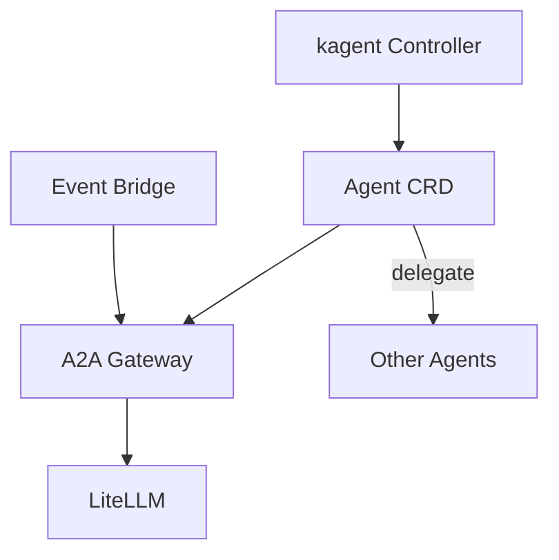

# AI Agents

Declarative AI agents orchestrated by kagent.

> **Navigation**: [← Back to AI README](../README.md)

## Overview

All agents run in the consolidated `kagent` namespace alongside the kagent controller and system agents.

**Custom Agents:**

- **[homelab](./homelab/)** - `homelab-agent`: Tech assistant for homelab topics (Discord interface)
- **[search](./search/)** - `search-agent`: Web search specialist using SearXNG

**System Agents (managed by kagent helm chart):**

- `k8s-agent`: Kubernetes cluster operations and troubleshooting
- `helm-agent`: Helm release management
- `cilium-policy-agent`: Cilium network policy creation
- `cilium-manager-agent`: Cilium installation and management
- `cilium-debug-agent`: Cilium debugging and diagnostics
- `observability-agent`: Prometheus/Grafana monitoring
- `promql-agent`: PromQL query generation

## Architecture

Agents are defined using kagent's declarative Agent CRD, with optional bridge components for event-driven integrations.

## Adding New Agents

1. Create a new directory under `agents/`
2. Define the Agent CRD with system prompt and model config (namespace: `kagent`)
3. Add any necessary bridge components for external integrations
4. Update this README with a link to the new agent
