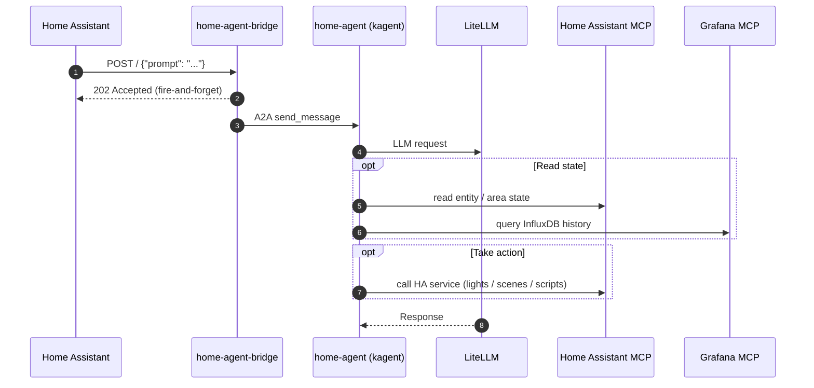

# Home Agent (Home Assistant Webhook)

The home automation agent, triggered by Home Assistant webhooks. Powered by kagent.

> **Navigation**: [← Back to Agents README](../README.md)

## Overview

This deployment includes:

- Declarative kagent `Agent` CR in the `agent-home` namespace
- `RemoteMCPServer` for Home Assistant (`homeassistant-mcp`, upstream HTTPS at `home.services.apocrathia.com:8123/api/mcp`, bearer token injected via `headersFrom` from a 1Password-backed Secret)
- `RemoteMCPServer` for Grafana (`grafana-mcp`, cluster-internal proxy in `mcp-grafana`)
- `home-agent-bridge` HelmRelease (`generic-app`) — a small Python HTTP server that accepts `POST /` with `{"prompt": "..."}` from Home Assistant's [`rest_command`](https://www.home-assistant.io/integrations/rest_command/) integration and forwards it to the agent via A2A
- `HTTPRoute` on the LAN-internal Cilium gateway (`main-gateway` on the private RFC1918 LB IP) at `home-agent.gateway.services.apocrathia.com`



## Configuration

### 1Password Secrets

Create a 1Password item:

#### home-agent-secrets (`vaults/Secrets/items/home-agent-secrets`)

- `litellm-api-key`: API key for LiteLLM access (LLM provider for the agent)
- `homeassistant-token`: Home Assistant Long-Lived Access Token, **including the `Bearer ` prefix** (e.g. `Bearer eyJhbGciOi...`). The kagent controller passes this value verbatim as the `Authorization` header when contacting the HA MCP endpoint.

### Trigger payload

The bridge accepts a single JSON shape on `POST /`:

```json
{ "prompt": "natural-language instruction for the agent" }
```

Anything else returns `400`. Empty/missing `prompt` returns `400`. A successful dispatch returns `202 Accepted` with a short request ID and runs the agent in the background — the response body is not waited on.

### Home Assistant `rest_command`

In Home Assistant's `configuration.yaml`:

```yaml
rest_command:
  home_agent:
    url: "https://home-agent.gateway.services.apocrathia.com/"
    method: POST
    content_type: "application/json"
    payload: '{"prompt": "{{ prompt }}"}'
```

Then call it from an automation, script, or button:

```yaml
service: rest_command.home_agent
data:
  prompt: "Porch motion just fired and it's after sunset. Turn on the porch light if it isn't already on."
```

The hostname `home-agent.gateway.services.apocrathia.com` resolves to the cluster's Cilium gateway, which lives on a private RFC1918 LB IP (`10.100.1.99`). HA reaches it over the LAN; nothing is exposed publicly.

### Access

- **Bridge URL (HA-facing)**: `https://home-agent.gateway.services.apocrathia.com/`
- **Bridge URL (cluster-internal)**: `http://home-agent-bridge.agent-home.svc.cluster.local:8080/`
- **kagent A2A Endpoint**: `http://kagent-controller.kagent.svc.cluster.local:8083/api/a2a/agent-home/home-agent`
- **kagent UI**: `https://kagent.gateway.services.apocrathia.com`

## Smoke test

From the LAN, fire a test prompt:

```bash
curl -i -X POST \
  -H 'Content-Type: application/json' \
  -d '{"prompt":"List the names of all light entities you can see."}' \
  https://home-agent.gateway.services.apocrathia.com/
```

Expected: `HTTP/1.1 202 Accepted` with `accepted <request-id>` body. Then watch the bridge and agent logs:

```bash
kubectl logs --namespace agent-home -l app=home-agent-bridge -f
kubectl logs --namespace agent-home -l kagent.dev/agent-name=home-agent -f
```

## Troubleshooting

### Bridge returns 4xx / 5xx

```bash
kubectl logs --namespace agent-home -l app=home-agent-bridge --tail=200
```

`400` means the request body wasn't valid JSON or didn't have a non-empty `prompt` string. Anything else (5xx) is a kagent A2A failure — see the agent logs.

### Agent runs but does nothing

```bash
kubectl get agent home-agent --namespace agent-home -o yaml
kubectl get remotemcpservers --namespace agent-home
kubectl logs --namespace agent-home -l kagent.dev/agent-name=home-agent --tail=200
```

If the HA MCP server returns 401, the `homeassistant-token` value in the 1Password item is missing the `Bearer ` prefix or the token has expired.

### Agent card resolution fails from the bridge

```bash
kubectl exec --namespace agent-home deploy/home-agent-bridge -- \
  curl -s http://kagent-controller.kagent.svc.cluster.local:8083/api/a2a/agent-home/home-agent/.well-known/agent-card.json
```

If this 404s, the agent CR didn't reconcile — check the kagent controller logs in the `kagent` namespace.

### HTTPRoute not attached

```bash
kubectl get httproute home-agent-bridge --namespace agent-home -o yaml
```

The `parentRefs` must point at `main-gateway` in `cilium-system`, section `https`. The route should report `Accepted: true` with the gateway in its status.

## References

- **[kagent Documentation](https://kagent.dev/docs)** - Agent orchestration platform
- **[A2A Protocol](https://a2a-protocol.org)** - Agent-to-Agent communication protocol
- **[Home Assistant `rest_command`](https://www.home-assistant.io/integrations/rest_command/)** - HTTP-trigger integration
- **[Home Assistant MCP server](https://www.home-assistant.io/integrations/mcp_server/)** - Upstream MCP integration
