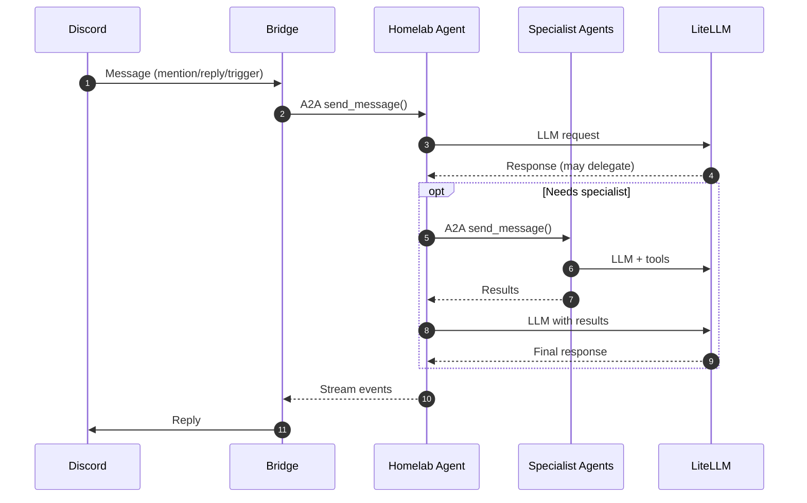

# Homelab Agent (Discord)

The homelab tech assistant, accessible via Discord. Powered by kagent.

> **Navigation**: [← Back to Agents README](../README.md)

## Documentation

- **[kagent Documentation](https://kagent.dev/docs)** - Agent orchestration platform
- **[A2A Protocol](https://a2a-protocol.org)** - Agent-to-Agent communication protocol
- **[discord.py](https://discordpy.readthedocs.io)** - Discord bot framework

## Overview

This deployment includes:

- Declarative kagent Agent CRD with system prompt and LLM configuration
- Lightweight Discord bridge that forwards messages to kagent via A2A
- Integration with LiteLLM for model access
- Delegation to specialized agents via A2A:
  - `search-agent` - Web search and URL reading
  - `k8s-agent` - Kubernetes cluster operations (system)
  - `helm-agent` - Helm release management (system)
  - `cilium-policy-agent` - Network policy creation (system)
  - `cilium-manager-agent` - Cilium management (system)
  - `observability-agent` - Prometheus/Grafana monitoring (system)



## Configuration

### 1Password Secrets

Create a 1Password item:

#### homelab-agent-secrets (`vaults/Secrets/items/homelab-agent-secrets`)

- `discord-token`: Discord bot token for authentication
- `litellm-api-key`: API key for LiteLLM access

### Access

- **kagent A2A Endpoint**: `http://kagent-controller.kagent.svc.cluster.local:8083/api/a2a/kagent/homelab-agent`
- **kagent UI**: `https://kagent.gateway.services.apocrathia.com`

## Troubleshooting

### Common Issues

1. **Bridge not connecting to kagent**

   ```bash
   # Check bridge logs
   kubectl logs -n kagent -l app.kubernetes.io/name=discord-bridge

   # Verify kagent agent is running
   kubectl get agent homelab-agent -n kagent
   ```

2. **Agent not responding**

   ```bash
   # Check agent pod status
   kubectl get pods -n kagent -l kagent.dev/agent-name=homelab-agent

   # View agent logs
   kubectl logs -n kagent -l kagent.dev/agent-name=homelab-agent
   ```

### Health Checks

```bash
# Overall status
kubectl get pods,svc -n kagent

# Check kagent resources
kubectl get agent,modelconfig -n kagent

# Test A2A endpoint
kubectl exec -n kagent deploy/discord-bridge -- \
  curl -s http://kagent-controller.kagent.svc.cluster.local:8083/api/a2a/kagent/homelab-agent/.well-known/agent-card.json
```
