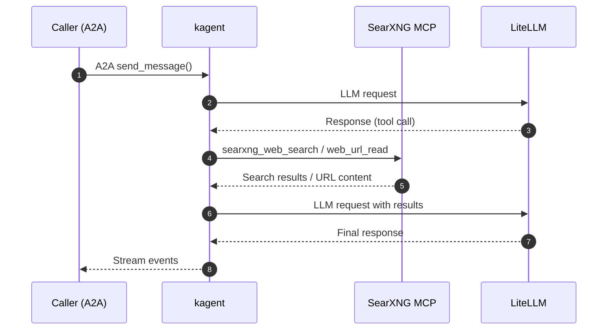

# Search Agent

Web search specialist powered by kagent. Uses SearXNG for search capabilities.

> **Navigation**: [← Back to Agents README](../README.md)

## Documentation

- **[kagent Documentation](https://kagent.dev/docs)** - Agent orchestration platform
- **[A2A Protocol](https://a2a-protocol.org)** - Agent-to-Agent communication protocol
- **[SearXNG](https://docs.searxng.org/)** - Privacy-respecting metasearch engine

## Overview

This deployment includes:

- Declarative kagent Agent CRD with search-focused system prompt
- Connection to the SearXNG MCP server for web search capabilities
- Integration with LiteLLM for model access



## Tools

### SearXNG MCP

The agent uses the kagent `MCPServer` in `mcp-searxng` namespace:

- **Tools**:
  - `searxng_web_search` - Web search with pagination, time filtering, language selection
  - `web_url_read` - Read and convert URL content to markdown
- **Backend**: SearXNG instance at `http://searxng.searxng.svc.cluster.local:8080`

## Configuration

### 1Password Secrets

Create a 1Password item:

#### searxng-agent-secrets (`vaults/Secrets/items/searxng-agent-secrets`)

- `litellm-api-key`: API key for LiteLLM access

### Access

- **kagent A2A Endpoint**: `http://kagent-controller.kagent-system.svc.cluster.local:8083/api/a2a/kagent-agents/search-agent`
- **kagent UI**: `https://kagent.gateway.services.apocrathia.com`

## Agent-to-Agent Integration

Other agents in `kagent-agents` can delegate to this agent by referencing it as a tool:

```yaml
spec:
  declarative:
    tools:
      - type: Agent
        agent:
          name: search-agent
          kind: Agent
          apiGroup: kagent.dev
```

The calling agent's LLM sees the `spec.description` field to decide when to delegate.

## Troubleshooting

### Common Issues

1. **Agent not responding**

   ```bash
   # Check agent status
   kubectl get agent -n kagent-agents search-agent

   # Check agent pod status
   kubectl get pods -n kagent-agents -l kagent.dev/agent-name=search-agent
   ```

2. **MCP Server not working**

   ```bash
   # Check MCPServer status
   kubectl get mcpserver -n mcp-searxng kagent-searxng-mcp

   # View MCP server pod logs
   kubectl logs -n mcp-searxng -l kagent.dev/mcpserver-name=kagent-searxng-mcp
   ```

### Health Checks

```bash
# Overall status
kubectl get agent,modelconfig -n kagent-agents

# Test A2A endpoint
curl -s http://kagent-controller.kagent-system.svc.cluster.local:8083/api/a2a/kagent-agents/search-agent/.well-known/agent-card.json
```
