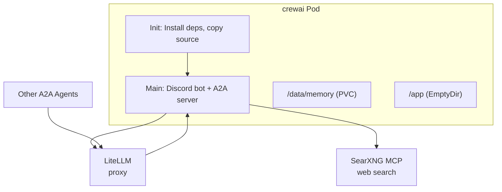

# CrewAI Discord Agent

Discord chatbot powered by CrewAI with web search and A2A (Agent-to-Agent) protocol support.

> **Navigation**: [← Back to AI README](../README.md)

## Documentation

- **[CrewAI Documentation](https://docs.crewai.com/)** - Official documentation
- **[discord.py](https://discordpy.readthedocs.io/)** - Discord library
- **[A2A Protocol](https://google.github.io/A2A/)** - Agent-to-Agent specification

## Overview

A Discord bot that uses CrewAI agents for intelligent conversation and web search. Responds to mentions, participates in relevant conversations, and doesn't hold back on the colorful language.

Also exposes an A2A protocol endpoint, allowing other agents to invoke this agent via LiteLLM's A2A gateway.

### Features

- **Conversational AI**: Responds to @mentions and participates in relevant conversations
- **Web Search**: Uses SearXNG MCP server for web search capabilities
- **A2A Protocol**: Exposes agent via A2A for inter-agent communication
- **A2A Delegation**: Can delegate tasks to other A2A agents registered in LiteLLM
- **Colorful Personality**: Profanity encouraged - keeps it real

## Configuration

### Required 1Password Secrets

Create a 1Password item at `vaults/Secrets/items/crewai-secrets` with:

| Field             | Description                             |
| ----------------- | --------------------------------------- |
| `discord-token`   | Discord bot token from Developer Portal |
| `litellm-api-key` | LiteLLM master key for API access       |

### Discord Bot Setup

1. Create application at https://discord.com/developers/applications
2. Enable these **Privileged Gateway Intents**:
   - ✅ Message Content Intent
   - ✅ Server Members Intent (optional)
3. Generate invite URL with scopes: `bot`, `applications.commands`
4. Bot permissions: `Send Messages`, `Read Message History`, `View Channels`, `Add Reactions`

### Environment Variables

| Variable           | Description                                              |
| ------------------ | -------------------------------------------------------- |
| `BOT_NAME`         | Bot display name                                         |
| `RESPONSE_CHANCE`  | Chance to respond unprompted (configured in helmrelease) |
| `LITELLM_BASE_URL` | LiteLLM proxy URL                                        |
| `A2A_ENABLED`      | Enable A2A server                                        |
| `A2A_PORT`         | Port for A2A server                                      |
| `A2A_BASE_URL`     | Base URL for A2A agent card                              |
| `MEMORY_PATH`      | Path for memory persistence (configured in helmrelease)  |

### Models

- **Primary**: `gpt-oss` (gpt-oss:20b via Ollama) - Main conversation model
- **Fast**: `llama3.2` (llama3.2:3b via Ollama) - Quick relevance checks

## Architecture



## A2A Integration

The agent exposes an A2A (Agent-to-Agent) protocol server on port 10001 that other agents can invoke.

### Registering with LiteLLM

Register this agent in LiteLLM's agent registry:

1. Navigate to LiteLLM Admin UI → **Agents** tab
2. Click **Add Agent**
3. Enter:
   - **Name**: `crewai-demo`
   - **URL**: `http://demo.crewai.svc.cluster.local:10001`

### A2A Endpoints

| Endpoint                       | Method | Description           |
| ------------------------------ | ------ | --------------------- |
| `/.well-known/agent-card.json` | GET    | Agent discovery       |
| `/`                            | POST   | JSON-RPC 2.0 messages |
| `/health`                      | GET    | Health check          |

### Invoking via LiteLLM

Other agents can invoke this agent through LiteLLM's A2A gateway:

```python
from a2a.client import A2ACardResolver, A2AClient
from a2a.types import MessageSendParams, SendMessageRequest

# Via LiteLLM gateway
base_url = "http://litellm.litellm.svc.cluster.local:4000/a2a/crewai-demo"
```

### Delegating to Other Agents

This agent automatically discovers other A2A agents registered in LiteLLM and can delegate tasks to them. The LLM decides when to delegate based on task requirements.

## Creating Additional Agents

To create a new agent based on this one:

1. Copy this directory to a new location
2. Modify `src/crew.py` to define new agents and tasks
3. Update MCP server connections for different tools
4. Adjust `main.py` for different interaction patterns

### Adding MCP Tools

Add new MCP servers in `crew.py`:

```python
from crewai.mcp import MCPServerHTTP

def _get_mcp_tools(self) -> list:
    return [
        MCPServerHTTP(url="http://mcp-server.namespace.svc:8080/mcp"),
    ]
```

### Using Different Models

Change the model in `crew.py`:

```python
self.llm = LLM(
    model="claude-sonnet-4-5",  # or any model in litellm.yml
    base_url=litellm_base_url,
    api_key=litellm_api_key,
)
```

## Troubleshooting

### Check Bot Logs

```bash
kubectl -n crewai logs deploy/crewai -f
```

### Verify Discord Connection

```bash
kubectl -n crewai logs deploy/crewai | grep -i "logged in"
```

### Test MCP Connectivity

```bash
kubectl -n crewai exec deploy/crewai -- \
  python -c "
import urllib.request
import json
url = 'http://mcp-searxng-mcp-proxy.mcp-searxng.svc.cluster.local:8080/mcp'
req = urllib.request.Request(url, method='POST')
req.add_header('Content-Type', 'application/json')
req.add_header('Accept', 'application/json')
data = json.dumps({'jsonrpc': '2.0', 'method': 'tools/list', 'id': 1}).encode()
resp = urllib.request.urlopen(req, data, timeout=10)
print(resp.read().decode())
"
```

### Memory Issues

Memory is stored in `/data/memory` on a persistent volume. To reset:

```bash
kubectl -n crewai exec deploy/crewai -- rm -rf /data/memory/*
kubectl -n crewai rollout restart deploy/crewai
```
