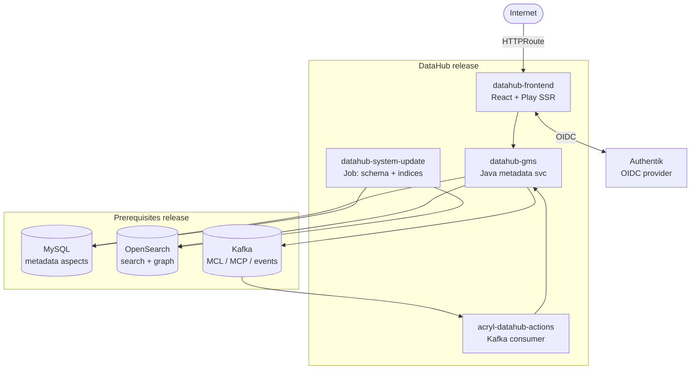

# DataHub

[DataHub](https://datahub.com/) is an open-source metadata platform for data discovery, lineage, and governance. Originally built at LinkedIn, it indexes datasets, dashboards, pipelines, and ML models from across a data stack and presents them through a single search and lineage UI.

> **Navigation**: [← Back to AI Applications README](../README.md)

## Overview

Two Helm releases land in the `datahub` namespace:

- `datahub-prerequisites` (release name `prerequisites`) — bundled OpenSearch, Kafka, and MySQL backing the metadata store, graph index, and event stream.
- `datahub` — the application: GMS (metadata service), the React frontend, the actions consumer, and the system-update job that bootstraps the schema.

Both come from the upstream chart at `helm.datahubproject.io`. The prerequisites release must reconcile first; the main release uses Flux `dependsOn` to enforce ordering.

## Access

- **External URL**: `https://datahub.gateway.services.apocrathia.com`
- **Internal Service** (frontend): `http://datahub-datahub-frontend.datahub.svc.cluster.local:9002`
- **Internal Service** (GMS API): `http://datahub-datahub-gms.datahub.svc.cluster.local:8080`

## Authentication

Authentik OIDC. DataHub's React frontend speaks OIDC natively — no proxy in front. The Authentik provider is created by the bundled blueprint as `datahub-oidc-provider`; client credentials live in `datahub-secrets`. The Authentik redirect URI is pinned to `/callback/oidc`.

## Configuration

### 1Password item

A single OnePasswordItem named `datahub-secrets` backs the entire deployment. The Bitnami MySQL chart, GMS, and the frontend's OIDC config all reference it directly.

**`vaults/Secrets/items/datahub-secrets`** — required keys:

- `mysql-root-password` — root user; DataHub connects as root
- `mysql-replication-password` — required by Bitnami chart contract even for single-node topology
- `mysql-password` — required by Bitnami chart contract; not used at runtime
- `oidc-client-id` — Authentik OIDC provider client ID
- `oidc-client-secret` — Authentik OIDC provider client secret

The OIDC client ID/secret are visible in Authentik's UI under the `datahub-oidc-provider` provider after the blueprint reconciles.

## Architecture



The actions consumer reads from Kafka and runs declarative rules (slack notifications, doc propagation). The system-update job runs on every install/upgrade to align OpenSearch indices and MySQL schema with the deployed app version.

## Initial Setup

1. Populate the `datahub-secrets` 1Password item with all five keys.
2. Wait for the authentik-blueprint to reconcile and copy the generated OIDC client ID and secret back into 1Password.
3. Wait for the prerequisites release to reach Ready (OpenSearch and Kafka volume provisioning dominate the wait).
4. Wait for the main release plus its pre-install system-update job.
5. Navigate to the external URL and authenticate with Authentik.
6. (Optional) Configure ingestion recipes from the UI under Ingestion → Create. Recipes run as Kubernetes Jobs spawned by the actions container.

## Troubleshooting

```bash
# Reconcile status of both releases
flux get hr -n datahub

# Pods across the whole stack
kubectl get pods -n datahub

# GMS startup and schema initialization
kubectl logs -n datahub deploy/datahub-datahub-gms -f

# System-update job (runs as a helm hook on install/upgrade)
kubectl logs -n datahub job/datahub-datahub-system-update -f

# Frontend OIDC behavior
kubectl logs -n datahub deploy/datahub-datahub-frontend -f | grep -i oidc

# OpenSearch index health
kubectl exec -n datahub opensearch-cluster-master-0 -- \
  curl -s http://localhost:9200/_cat/indices

# Kafka topic list (controller pod doubles as broker in single-node KRaft)
kubectl exec -n datahub prerequisites-kafka-controller-0 -- \
  kafka-topics.sh --bootstrap-server localhost:9092 --list

# MySQL connection check
kubectl exec -n datahub prerequisites-mysql-0 -- \
  mysql -u root -p"$(kubectl get secret -n datahub datahub-secrets -o jsonpath='{.data.mysql-root-password}' | base64 -d)" \
  -e "USE datahub; SHOW TABLES;"
```

Common failure modes:

- **System-update job stuck**: usually waiting on OpenSearch or Kafka readiness. Check those pods first before re-running the job.
- **Frontend redirect loop after OIDC login**: `AUTH_OIDC_BASE_URL` doesn't match the redirect URI registered in Authentik. The base URL is set explicitly because ingress is disabled; the Authentik blueprint pins `/callback/oidc` as the strict redirect URI.
- **GMS crashloop on first install**: prerequisites usually wasn't fully ready when GMS started. `flux suspend` and `flux resume` the main release once prerequisites pods are all `Running`.

## References

- **[DataHub Documentation](https://docs.datahub.com/)** - Architecture and feature guides
- **[Helm Chart Source](https://github.com/acryldata/datahub-helm)** - Chart values and templates
- **[OIDC Authentication Guide](https://docs.datahub.com/docs/authentication/guides/sso/configure-oidc-react)** - Frontend OIDC env var reference
- **[DataHub GitHub](https://github.com/datahub-project/datahub)** - Application source code
