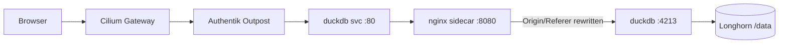

# DuckDB

The official [DuckDB](https://duckdb.org/) UI deployed behind Authentik for ad-hoc SQL and notebook-style data exploration. DuckDB is an in-process analytical database — think SQLite, but for OLAP — that can query Parquet, CSV, JSON, S3, and its own native files without needing a separate server.

> **Navigation**: [← Back to AI Applications README](../README.md)

## Overview

This deployment runs the upstream `duckdb/duckdb` distroless CLI image and starts the UI extension via `start_ui_server()`. Storage:

- DuckDB process holds `/data/notebooks.duckdb` open as the default attached database.
- `HOME=/data` so the UI extension state (notebooks, query history) lives at `/data/.duckdb/extension_data/ui/ui.db` and survives pod restarts on a Longhorn volume.
- `/shared` is an SMB-backed read-write mount of `//storage.services.apocrathia.com/Library/Databases/DuckDB`, shared with the MCP server. Use this for Parquet/CSV/JSON files that should be reachable from both the UI and agents.
- An nginx sidecar bridges the cluster network to DuckDB's localhost-only UI server (see _Architecture_ below).

For an agent-callable DuckDB instance, see [`mcp-servers/duckdb`](../mcp-servers/duckdb/) — separate process, separate `.duckdb` file, same `/shared` SMB mount.

## Sharing data with the MCP server

DuckDB's single-writer file lock prevents two pods from opening the same `.duckdb` file. Shared state lives in the SMB mount instead, as Parquet (or CSV/JSON):

```sql
-- In the UI: export a table for agents to consume
COPY (SELECT * FROM my_table) TO '/shared/exports/my_table.parquet' (FORMAT PARQUET);

-- In the UI: read what an agent wrote
SELECT * FROM read_parquet('/shared/agent-outputs/*.parquet');
```

Concurrent reads of the same file are safe. Concurrent writes to the same file will clobber — adopt a directory naming convention (e.g., `/shared/notebooks/`, `/shared/agents/`, `/shared/datasets/`) if you expect both sides to write.

## Access

- **External URL**: `https://duckdb.gateway.services.apocrathia.com`
- **Internal Service**: `http://duckdb.duckdb.svc.cluster.local:80`

## Architecture

The DuckDB UI is upstream-designed as a single-user local development tool. It calls `server.listen("localhost", 4213)` — and on the distroless cc-debian12 image that `getaddrinfo` resolves to `::1` first, so the listener ends up on IPv6 loopback (`[::1]:4213`), not IPv4. The UI also validates `Origin`/`Referer` against `http://localhost:4213` for CSRF. To make it reachable behind the gateway, an nginx sidecar runs in the same pod, proxies to `[::1]:4213`, and rewrites those headers inbound:



## Trade-offs

The official UI has **no concept of users**. Authentik gates who can reach the gateway, but everyone behind the gate sees the same notebooks and queries the same database. Treat this as a shared scratchpad, not a per-user workspace.

The DuckDB CLI also exits when stdin closes. The container needs `stdin: true` on the pod spec to keep the UI process alive — a passthrough not currently exposed by the generic-app chart. The first-deploy pod will crash-loop until the chart adds that field; this is intentional and used as the empirical confirmation step before bumping the chart.

## Authentication

Authentik proxy provider in front of the gateway. The DuckDB UI itself has no authentication, so the proxy is the only line of defense — do not expose the service externally without it.

## Troubleshooting

```bash
# Pod and sidecar status
kubectl get pods -n duckdb

# DuckDB process logs (look for the UI server URL line)
kubectl logs -n duckdb deploy/duckdb -c duckdb

# nginx sidecar logs (will show 502 if duckdb is dead)
kubectl logs -n duckdb deploy/duckdb -c nginx

# Hit the UI from inside the cluster (bypass nginx, see what duckdb returns)
kubectl exec -n duckdb deploy/duckdb -c nginx -- wget -qO- http://127.0.0.1:4213/

# Inspect the persistent volume contents (extension cache, ui.db)
kubectl exec -n duckdb deploy/duckdb -c nginx -- ls -la /data/.duckdb/extension_data/ui/
```

## References

- **[DuckDB Documentation](https://duckdb.org/docs/)** - SQL reference and extension docs
- **[DuckDB UI Announcement](https://duckdb.org/2025/03/12/duckdb-ui)** - The blog post introducing the local UI
- **[duckdb/duckdb-ui](https://github.com/duckdb/duckdb-ui)** - UI extension source
- **[Hosting DuckDB UI (issue #132)](https://github.com/duckdb/duckdb-ui/issues/132)** - Upstream tracking of remote-hosting workarounds
