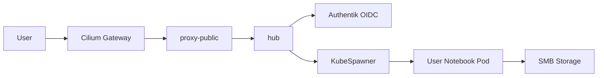

# JupyterHub

Multi-user Jupyter notebook server for interactive computing with Authentik OIDC authentication and shared SMB storage.

> **Navigation**: [← Back to AI & Automation](../README.md)

## Documentation

- [JupyterHub Documentation](https://jupyterhub.readthedocs.io/)
- [Zero to JupyterHub](https://z2jh.jupyter.org/)
- [Chart Repository](https://github.com/jupyterhub/zero-to-jupyterhub-k8s)

## Overview

Zero to JupyterHub on Kubernetes (z2jh) deployment providing:

- **Multi-user Support**: KubeSpawner dynamically creates user notebook pods
- **Authentik OIDC**: Native OAuth integration for SSO
- **Shared Storage**: SMB-backed persistent storage with per-user subdirectories
- **Profile Selection**: Users choose between JupyterLab (PyTorch) or VS Code environments
- **Idle Culling**: Automatic cleanup of inactive user servers

## Architecture



## Configuration

See `helmrelease.yaml` for complete configuration.

### Secrets

**1Password item `jupyterhub-secrets`:**

| Field                | Description                  |
| -------------------- | ---------------------------- |
| `oidc-client-id`     | Authentik OIDC client ID     |
| `oidc-client-secret` | Authentik OIDC client secret |

**1Password item `smb-credentials`:**

| Field      | Description        |
| ---------- | ------------------ |
| `username` | SMB share username |
| `password` | SMB share password |

## Authentication

Users authenticate via Authentik OIDC. The Authentik blueprint in this directory creates the provider and application automatically. After deployment, copy the generated client credentials to 1Password.

## Troubleshooting

### Pod Status

```bash
kubectl get pods -n jupyterhub
kubectl get pods -n jupyterhub -l component=singleuser-server
kubectl logs -n jupyterhub -l component=hub --tail=50
```

### Spawn Failures

```bash
kubectl describe pod -n jupyterhub jupyter-<username>
kubectl logs -n jupyterhub -l component=hub | grep -i spawn
```

### Storage Issues

```bash
kubectl get pv jupyterhub-notebooks-pv
kubectl get pvc -n jupyterhub jupyterhub-notebooks
kubectl get secret -n jupyterhub smb-credentials
```
