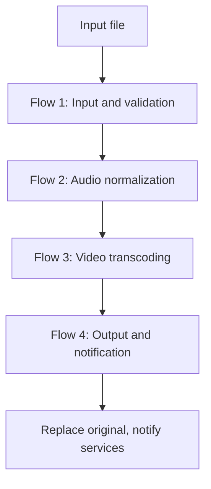
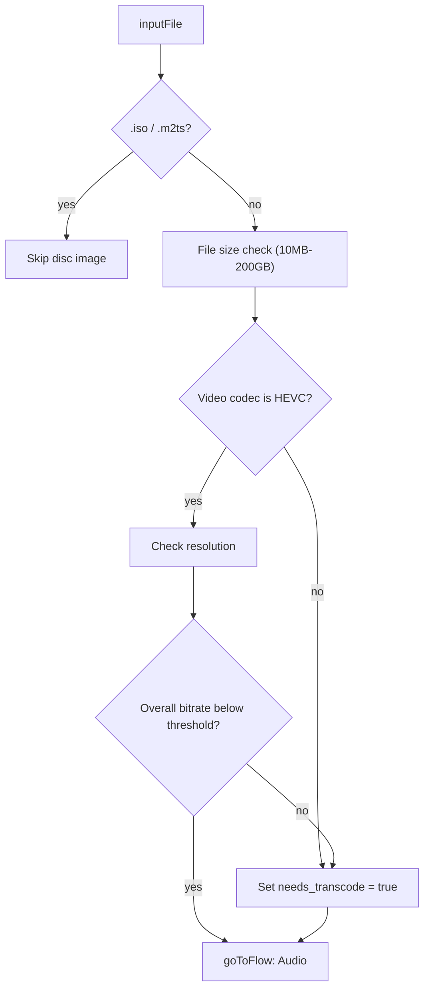
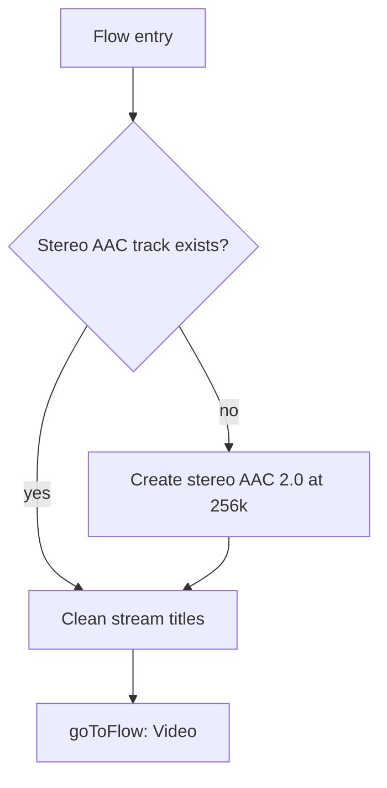
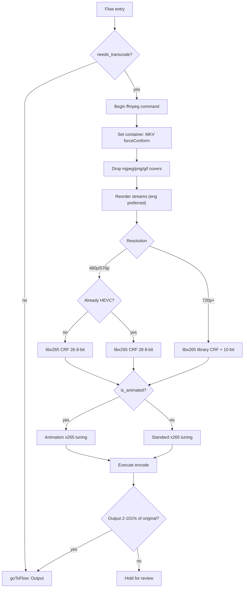
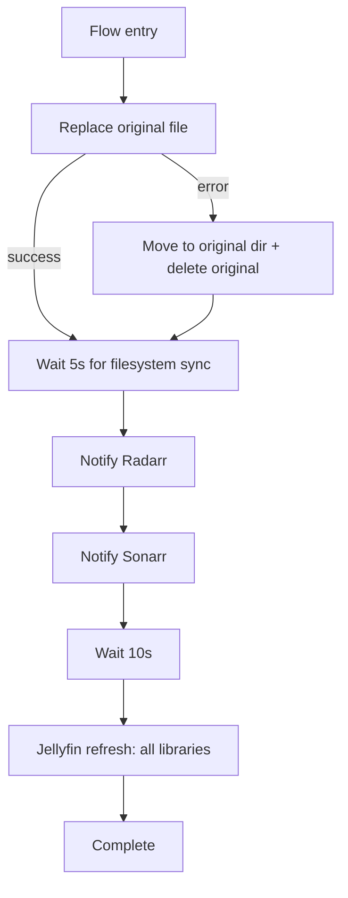

# Tdarr custom flows

Custom flow set for CPU-only HEVC transcoding across Movies, TV, and Anime libraries. Four flows handle the full pipeline from input validation through notification.

## Flow architecture



All files pass through every flow. Flow 1 sets a `needs_transcode` variable that Flow 3 checks to decide whether to encode or skip straight to output.

### Flow 1: Input and validation

Entry point. Determines whether the file needs video transcoding, sets the `needs_transcode` flow variable, and routes to the audio flow. All files proceed through the full pipeline regardless of codec — the variable controls whether Flow 3 performs a video transcode or skips straight to output.



Overall bitrate thresholds for HEVC skip logic (uses `checkOverallBitrate` since per-stream video bitrate is unavailable on VBR x265 MKV files):

- SD (480p / 576p): skip if under **0.75 Mbps** (re-queues grown low-bitrate HEVC for CRF 28 re-shrink)
- 720p: skip if under 4 Mbps
- 1080p: skip if under 10 Mbps
- 4K: skip if under 25 Mbps
- 8K and other resolutions: always transcode

`.iso` / `.m2ts` end the pipeline immediately (no encode).

### Flow 2: Audio normalization

Ensures a stereo AAC 2.0 track exists and cleans stream titles. Stream reordering is handled in the video flow to avoid unnecessary remuxing.



Audio track selection for AAC creation:

- Downmixes from the first audio track
- All original audio streams are kept untouched

### Flow 3: Video transcoding

HEVC encoding with correct libx265 CPU argument construction. SD and HD+ take different CRF / bit-depth paths. Includes stream reordering and animation-aware tuning.



`-preset` is a top-level ffmpeg option, NOT inside `-x265-params`. `lookahead` goes inside `-x265-params`.

Size verify is **2%–101%** (sanity floor + allow tiny remux wiggle, block real
growth). `forceConform` on MKV drops
containers/subs that cannot mux (e.g. `mov_text`). Embedded cover/image streams
(`mjpeg` / `png` / `gif`) are removed before encode — sidecars cover artwork.

### Flow 4: Output and notification

File replacement and service notifications. Handles cross-device file moves (EXDEV) with a fallback path. Each notification node handles "not found" gracefully — Radarr ignores TV shows, Sonarr ignores movies, and the flow continues regardless. The Jellyfin refresh uses the native `Send Web Request` (`webRequest`) flow plugin to call Jellyfin's `POST /Library/Refresh` API, which rescans all libraries in one call.



## Variable configuration

### Global variables

| Variable           | Value                                        | Purpose                                 |
| ------------------ | -------------------------------------------- | --------------------------------------- |
| `url_jellyfin`     | `http://jellyfin.jellyfin.svc.cluster.local` | Jellyfin server URL (no trailing slash) |
| `api_key_jellyfin` | `[from Jellyfin admin API keys]`             | Jellyfin API key (`X-Emby-Token`)       |
| `url_radarr`       | `http://radarr.radarr.svc.cluster.local`     | Radarr service URL                      |
| `url_sonarr`       | `http://sonarr.sonarr.svc.cluster.local`     | Sonarr service URL                      |
| `api_key_radarr`   | `[from 1password]`                           | Radarr API key                          |
| `api_key_sonarr`   | `[from 1password]`                           | Sonarr API key                          |

### Library variables

| Variable        | MOVIES     | TV         | ANIME      | Purpose                                    |
| --------------- | ---------- | ---------- | ---------- | ------------------------------------------ |
| `quality_level` | `20`       | `20`       | `20`       | CRF value (lower = higher quality)         |
| `ffmpeg_preset` | `veryslow` | `veryslow` | `veryslow` | Encoding speed/quality tradeoff            |
| `video_codec`   | `libx265`  | `libx265`  | `libx265`  | Video codec (future: libsvtav1)            |
| `is_animated`   | `false`    | `false`    | `true`     | Selects animation-tuned x265 encode params |

### Importing flows

Flow JSON files are stored in this directory for version control. To import them into Tdarr:

1. Open the Tdarr web interface
2. Go to Flows
3. Click "Add Flow"
4. Scroll to the bottom and paste the JSON into "Import JSON Template"
5. Repeat for each flow file (01-input.json through 04-output.json)

The flow IDs are pre-wired across the JSON files. Each flow's `_id` matches the `flowId` referenced by the upstream flow's `goToFlow` node, so no manual ID editing is needed after import.

## Database variable management

Variables are stored in Tdarr's SQLite database (`/app/server/Tdarr/DB2/SQL/database.db`) in the `variablesjsondb` table. Each variable is stored as a JSON object:

```json
{
  "key": "variable_name",
  "value": "variable_value",
  "type": "global|library:LIBRARY_ID",
  "date": 1234567890123,
  "_id": "randomID"
}
```

### Variable types

- Global variables: `type: "global"`
- Library variables: `type: "library:LIBRARY_ID"` where LIBRARY_ID is the library's internal ID

### Finding library IDs

Library IDs can be retrieved from the database by querying the `librarysettingsjsondb` table. The Tdarr container does not include the `sqlite3` CLI, so Python must be used:

```python
import sqlite3
import json

db = '/app/server/Tdarr/DB2/SQL/database.db'
conn = sqlite3.connect(db)
cur = conn.cursor()

cur.execute('SELECT id, json_data FROM librarysettingsjsondb')
for lib_id, json_data in cur.fetchall():
    data = json.loads(json_data)
    print(f"ID: {lib_id}, Name: {data['name']}")
```

Library IDs are generated by Tdarr and change if the database is recreated. Always verify library IDs before inserting variables.

### Inserting variables

When inserting variables while Tdarr is running, use individual transactions to prevent database corruption. Each variable must be inserted in its own transaction with proper locking. Inserting more than one row at a time will corrupt the database.

```python
import sqlite3
import json
import random
import string
import time

def insert_var(key, value, vtype, db_path):
    """Insert a single variable in its own transaction."""
    conn = sqlite3.connect(db_path, timeout=10.0)
    try:
        cur = conn.cursor()
        cur.execute('BEGIN IMMEDIATE TRANSACTION')

        var_id = ''.join(random.choices(string.ascii_letters + string.digits, k=9))
        ts_sec = int(time.time())
        ts_ms = int(time.time() * 1000)

        jdata = json.dumps({
            'key': key,
            'value': value,
            'type': vtype,
            'date': ts_ms,
            '_id': var_id
        })

        cur.execute(
            'INSERT INTO variablesjsondb (id, timestamp, json_data) VALUES (?, ?, ?)',
            (var_id, ts_sec, jdata)
        )
        conn.commit()
        return True
    except Exception as e:
        conn.rollback()
        raise e
    finally:
        conn.close()

db = '/app/server/Tdarr/DB2/SQL/database.db'
insert_var('url_jellyfin', 'http://jellyfin.jellyfin.svc.cluster.local', 'global', db)
insert_var('quality_level', '20', 'library:LIBRARY_ID', db)
```

- Always use `BEGIN IMMEDIATE TRANSACTION` for proper locking when Tdarr is running
- Insert variables one at a time, not in bulk transactions
- Add small delays (0.1s) between inserts when Tdarr is actively running

### Variable migration script

Run this inside the tdarr-server pod to wipe the old One-Flow variables and insert the new ones. Replace `LIBRARY_ID` placeholders with actual IDs from the library ID query above.

```python
import sqlite3
import json
import random
import string
import time

db = '/app/server/Tdarr/DB2/SQL/database.db'

def insert_var(key, value, vtype):
    conn = sqlite3.connect(db, timeout=10.0)
    try:
        cur = conn.cursor()
        cur.execute('BEGIN IMMEDIATE TRANSACTION')
        var_id = ''.join(random.choices(string.ascii_letters + string.digits, k=9))
        ts_sec = int(time.time())
        ts_ms = int(time.time() * 1000)
        jdata = json.dumps({
            'key': key, 'value': value, 'type': vtype,
            'date': ts_ms, '_id': var_id
        })
        cur.execute(
            'INSERT INTO variablesjsondb (id, timestamp, json_data) VALUES (?, ?, ?)',
            (var_id, ts_sec, jdata)
        )
        conn.commit()
    except Exception as e:
        conn.rollback()
        raise e
    finally:
        conn.close()
    time.sleep(0.1)

# Step 1: wipe all existing variables
conn = sqlite3.connect(db, timeout=10.0)
try:
    cur = conn.cursor()
    cur.execute('BEGIN IMMEDIATE TRANSACTION')
    cur.execute('DELETE FROM variablesjsondb')
    conn.commit()
    print('Wiped all existing variables')
finally:
    conn.close()
time.sleep(0.5)

# Step 2: insert global variables
globals_to_insert = {
    'url_jellyfin': 'http://jellyfin.jellyfin.svc.cluster.local',
    'api_key_jellyfin': 'REPLACE_WITH_JELLYFIN_API_KEY',
    'url_radarr': 'http://radarr.radarr.svc.cluster.local',
    'url_sonarr': 'http://sonarr.sonarr.svc.cluster.local',
    'api_key_radarr': 'REPLACE_WITH_RADARR_API_KEY',
    'api_key_sonarr': 'REPLACE_WITH_SONARR_API_KEY',
}

for key, value in globals_to_insert.items():
    insert_var(key, value, 'global')
    print(f'Inserted global: {key}')

# Step 3: insert library variables
# Replace these with actual library IDs from the query above
libraries = {
    'Movies': 'REPLACE_WITH_MOVIES_LIBRARY_ID',
    'TV Shows': 'REPLACE_WITH_TV_LIBRARY_ID',
    'Anime': 'REPLACE_WITH_ANIME_LIBRARY_ID',
}

lib_vars = {
    'quality_level': '20',
    'ffmpeg_preset': 'veryslow',
    'video_codec': 'libx265',
    'is_animated': 'false',
}

anime_overrides = {
    'is_animated': 'true',
}

for lib_name, lib_id in libraries.items():
    merged = {**lib_vars, **(anime_overrides if lib_name == 'Anime' else {})}
    for key, value in merged.items():
        insert_var(key, value, f'library:{lib_id}')
        print(f'Inserted {lib_name}: {key}={value}')

print('Migration complete')
```

### Database corruption recovery

If the database becomes corrupted (e.g., from concurrent writes), Tdarr will recreate it on restart. Library IDs will change, so variables must be re-inserted with the new IDs.

## Troubleshooting

1. **Files requeuing**: Check that flows are assigned to the correct libraries in the Tdarr UI
2. **Permission errors**: Ensure volume mounts have write access (`readOnly: false`)
3. **Variable not found**: Verify variable names and library IDs are correct
4. **Flow not executing**: Confirm libraries are set to use flows (not plugins)
5. **goToFlow errors**: Flow IDs are pre-wired in the JSON files. If Tdarr reassigns IDs on import, update the goToFlow nodes to match
6. **CPU encoding failures**: Verify the ffmpeg command has `-preset` as a top-level argument, not inside `-x265-params`
