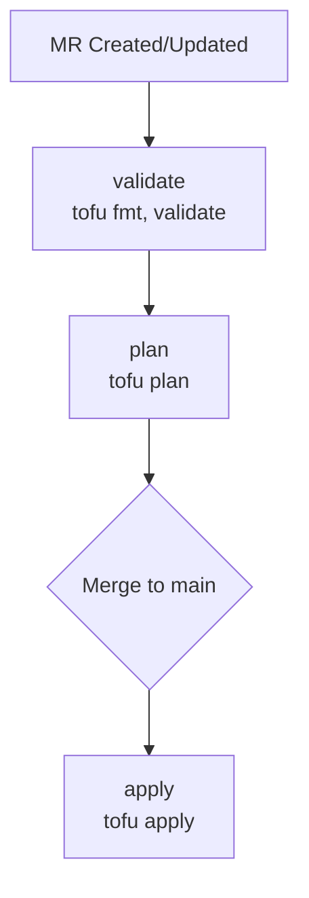

# Terraform (OpenTofu + Terragrunt)

Infrastructure as Code for Proxmox VMs using OpenTofu and Terragrunt.

> **Navigation**: [← Home](../README.md) | [Talos Setup →](../talos/README.md)

## Overview

OpenTofu configurations for managing Proxmox virtual machines running the Talos Kubernetes cluster.

| Tool                                                                           | Purpose                                                            |
| ------------------------------------------------------------------------------ | ------------------------------------------------------------------ |
| [OpenTofu](https://opentofu.org/)                                              | Infrastructure as Code engine (Linux Foundation fork of Terraform) |
| [Terragrunt](https://terragrunt.gruntwork.io/)                                 | Thin wrapper for DRY configurations and multi-module orchestration |
| [bpg/proxmox](https://registry.terraform.io/providers/bpg/proxmox/latest/docs) | Proxmox provider for OpenTofu                                      |

### Current Scope

| Resource  | Count | Description                                     |
| --------- | ----- | ----------------------------------------------- |
| Talos VMs | 4     | Control plane nodes (talos-01 through talos-04) |

### VM Inventory

| VM       | VMID | Proxmox Node | IP Address  |
| -------- | ---- | ------------ | ----------- |
| talos-01 | 801  | node-01      | 10.100.1.80 |
| talos-02 | 802  | node-02      | 10.100.1.81 |
| talos-03 | 803  | node-03      | 10.100.1.82 |
| talos-04 | 804  | node-04      | 10.100.1.83 |

### Future Scope

- Additional VMs (storage, utility nodes)
- Proxmox cluster configuration
- Network/VLAN configuration
- DNS records

## Architecture

### Why OpenTofu?

HashiCorp switched Terraform to BSL 1.1 in August 2023. OpenTofu is the Linux Foundation's MPL 2.0 fork - truly open source, drop-in compatible, community governed.

### Why Terragrunt?

- **DRY configurations** - define common settings once, inherit everywhere
- **Multi-module orchestration** - `terragrunt run-all plan` across all VMs
- **Automatic backend configuration** - no copy-paste of backend blocks
- **Input inheritance** - common VM specs in parent, unique values per-VM

Terragrunt auto-detects OpenTofu when both are installed.

### State Backend

GitLab-managed Terraform state via HTTP backend - remote storage, state locking, versioning, and native CI/CD integration without additional infrastructure.

The root `terragrunt.hcl` configures the backend:

```hcl
remote_state {
  backend = "http"
  config = {
    address        = get_env("TF_HTTP_ADDRESS")
    lock_address   = get_env("TF_HTTP_LOCK_ADDRESS")
    unlock_address = get_env("TF_HTTP_UNLOCK_ADDRESS")
    username       = get_env("TF_HTTP_USERNAME")
    password       = get_env("TF_HTTP_PASSWORD")
    lock_method    = "POST"
    unlock_method  = "DELETE"
  }
}
```

### Authentication

| Variable                   | Description                                     | Masked |
| -------------------------- | ----------------------------------------------- | ------ |
| `PROXMOX_API_URL`          | Proxmox API endpoint (e.g., `https://pve:8006`) | No     |
| `PROXMOX_API_TOKEN_ID`     | API token ID (e.g., `user@pam!tokenname`)       | No     |
| `PROXMOX_API_TOKEN_SECRET` | API token secret                                | Yes    |

> **Note**: The provider wants the base URL without `/api2/json` suffix.

## Directory Structure

```
terraform/
├── README.md
├── terragrunt.hcl                      # Root config (backend, provider)
├── modules/
│   └── talos-vm/
│       ├── main.tf
│       ├── variables.tf
│       └── outputs.tf
└── deployments/
    └── proxmox/
        └── talos-cluster/
            ├── terragrunt.hcl          # Common inputs (CPU, RAM, network)
            ├── talos-01/
            │   └── terragrunt.hcl      # VM-specific: hostname, VMID, IP
            ├── talos-02/
            │   └── terragrunt.hcl
            ├── talos-03/
            │   └── terragrunt.hcl
            └── talos-04/
                └── terragrunt.hcl
```

### Configuration Hierarchy

```
Root terragrunt.hcl
    └── Backend config (GitLab HTTP state)
    └── Provider config (Proxmox API)
            │
            ▼
deployments/proxmox/talos-cluster/terragrunt.hcl
    └── Common VM inputs (CPU, RAM, disk size, storage pool)
            │
            ▼
deployments/proxmox/talos-cluster/talos-XX/terragrunt.hcl
    └── Per-VM inputs (hostname, VMID, Proxmox node, IP address)
    └── terraform { source = "../../../../modules/talos-vm" }
```

Each VM runs on a dedicated Proxmox node, so `proxmox_node` is a per-VM input.

## Prerequisites

### Version Requirements

```bash
tofu version       # >= 1.6.0
terragrunt --version  # >= 0.55.0
```

### Installation (macOS)

```bash
brew install opentofu terragrunt
```

### Proxmox API Token

Create an API token in Proxmox (Datacenter → Permissions → API Tokens → Add) with these permissions:

- `VM.Allocate`, `VM.Audit`, `VM.Config.*`, `VM.PowerMgmt`
- `Datastore.AllocateSpace`, `Datastore.Audit`

### GitLab CI/CD Variables

Configure in GitLab (Settings → CI/CD → Variables):

| Variable                   | Type     | Protected | Masked |
| -------------------------- | -------- | --------- | ------ |
| `PROXMOX_API_URL`          | Variable | Yes       | No     |
| `PROXMOX_API_TOKEN_ID`     | Variable | Yes       | No     |
| `PROXMOX_API_TOKEN_SECRET` | Variable | Yes       | Yes    |

## Import Strategy

VMs already exist in Proxmox - import them into state rather than recreate.

### Step 1: Capture Current VM Configuration

```bash
curl -s \
  -H "Authorization: PVEAPIToken=${PROXMOX_API_TOKEN_ID}=${PROXMOX_API_TOKEN_SECRET}" \
  "${PROXMOX_API_URL}/api2/json/nodes/{node}/qemu/{vmid}/config" | jq
```

### Step 2: Write Module and Deployment Configs

1. Create `modules/talos-vm/` module matching VM specs
2. Create `terragrunt.hcl` files with appropriate inputs
3. Ensure inputs match actual VM configuration

### Step 3: Import Existing Resources

Import ID format: `node_name/vm_id` (e.g., `node-01/801`)

```bash
cd deployments/proxmox/talos-cluster/talos-01
terragrunt init
terragrunt import proxmox_virtual_environment_vm.this node-01/801
```

Or batch import:

```bash
cd deployments/proxmox/talos-cluster

# Each VM is on its own Proxmox node
declare -A VM_MAP=(
  ["talos-01"]="node-01/801"
  ["talos-02"]="node-02/802"
  ["talos-03"]="node-03/803"
  ["talos-04"]="node-04/804"
)

for vm in "${!VM_MAP[@]}"; do
  import_id="${VM_MAP[$vm]}"
  echo "Importing ${vm} (${import_id})..."
  (
    cd "${vm}" && \
    terragrunt init && \
    terragrunt import proxmox_virtual_environment_vm.this "${import_id}"
  )
done
```

### Step 4: Verify and Iterate

```bash
terragrunt run-all plan
```

Adjust module/inputs until plan shows no changes.

### Common Import Drift

After import, `terragrunt plan` may show spurious changes. Common fixes:

| Attribute       | Symptom                                          | Resolution                                 |
| --------------- | ------------------------------------------------ | ------------------------------------------ |
| `cpu.type`      | `host` vs `x86-64-v2-AES`                        | Match actual: `qm config VMID \| grep cpu` |
| `scsi_hardware` | `virtio-scsi-pci` vs `virtio-scsi-single`        | Check VM hardware tab                      |
| `boot_order`    | Proxmox stores `order=scsi0;net0`                | Set as list in module                      |
| `on_boot`       | May default differently                          | Set explicitly                             |
| `started`       | Provider wants bool, Proxmox has different state | Set `started = true`                       |

Run `qm config VMID` on each Proxmox node to get exact values.

### Step 5: Commit Lock Files

```bash
git add deployments/**/.terraform.lock.hcl
```

## CI/CD Pipeline

> **TODO**: Create `.gitlab/tofu.gitlab-ci.yml` and add to `.gitlab-ci.yml` includes.

| Stage    | Job             | Trigger            | Description                         |
| -------- | --------------- | ------------------ | ----------------------------------- |
| validate | `tofu-validate` | All MRs            | Syntax and configuration validation |
| plan     | `tofu-plan`     | All MRs            | Generate and display execution plan |
| apply    | `tofu-apply`    | Manual (main only) | Apply changes to infrastructure     |



Key considerations:

- Use image with OpenTofu + Terragrunt (e.g., `alpine/terragrunt`)
- Cache `.terragrunt-cache` directory
- Store plan output as artifact
- Require manual approval for apply on main

## Local Development

### Environment Setup

```bash
# Proxmox API
export PROXMOX_API_URL="https://pve.example.com:8006"
export PROXMOX_API_TOKEN_ID="user@pam!tokenname"
export PROXMOX_API_TOKEN_SECRET="your-secret"

# GitLab HTTP backend
export GITLAB_ACCESS_TOKEN="your-gitlab-token"
export TF_HTTP_USERNAME="your-username"
export TF_HTTP_PASSWORD="${GITLAB_ACCESS_TOKEN}"
export TF_HTTP_ADDRESS="https://gitlab.com/api/v4/projects/PROJECT_ID/terraform/state/STATE_NAME"
export TF_HTTP_LOCK_ADDRESS="${TF_HTTP_ADDRESS}/lock"
export TF_HTTP_UNLOCK_ADDRESS="${TF_HTTP_ADDRESS}/lock"
```

### Single VM Operations

```bash
cd terraform/deployments/proxmox/talos-cluster/talos-01
terragrunt init
terragrunt plan
terragrunt apply
```

### All VMs at Once

```bash
cd terraform/deployments/proxmox/talos-cluster
terragrunt run-all init
terragrunt run-all plan
terragrunt run-all apply
```

### Validate Configuration

```bash
cd terraform
terragrunt hclfmt --check

cd deployments/proxmox/talos-cluster
terragrunt run-all validate
```

### Pre-commit Hooks

Add to `.pre-commit-config.yaml`:

```yaml
repos:
  - repo: https://github.com/gruntwork-io/pre-commit
    rev: v0.1.23
    hooks:
      - id: terragrunt-hclfmt
      - id: tflint
  - repo: https://github.com/tofuutils/pre-commit-opentofu
    rev: v2.1.0
    hooks:
      - id: tofu_fmt
      - id: tofu_validate
```

Run manually:

```bash
pre-commit run --all-files
```

## Troubleshooting

### State Lock Issues

```bash
terragrunt force-unlock LOCK_ID
```

### Import Failures

```bash
terragrunt state list
terragrunt state rm proxmox_virtual_environment_vm.this
```

### Provider Authentication

```bash
curl -s \
  -H "Authorization: PVEAPIToken=${PROXMOX_API_TOKEN_ID}=${PROXMOX_API_TOKEN_SECRET}" \
  "${PROXMOX_API_URL}/api2/json/version" | jq
```

### Terragrunt Cache Issues

```bash
find terraform -name ".terragrunt-cache" -type d -exec rm -rf {} +
terragrunt run-all init
```

### Drift After Import

If plan shows changes after import, capture the actual VM config:

```bash
# On each Proxmox node
qm config 801  # Adjust VMID as needed
```

Match module inputs exactly to the output, paying attention to:

- `cpu` type (e.g., `host`, `x86-64-v2-AES`)
- `scsihw` (SCSI controller type)
- `boot` order
- `memory` and `balloon` settings

## References

- [OpenTofu Documentation](https://opentofu.org/docs/)
- [Terragrunt Documentation](https://terragrunt.gruntwork.io/docs/)
- [bpg/proxmox Provider](https://registry.terraform.io/providers/bpg/proxmox/latest/docs)
- [GitLab Terraform State](https://docs.gitlab.com/ee/user/infrastructure/iac/terraform_state.html)
- [Proxmox API Documentation](https://pve.proxmox.com/pve-docs/api-viewer/)
